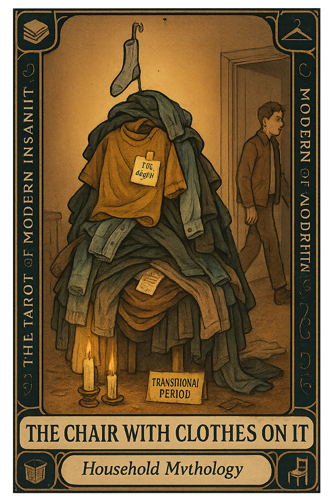

# The Chair With Clothes On It

## Meaning

Every bedroom contains a chair that is no longer a chair. It is a garment monument, a soft archive of every day you were almost ready to deal with it.

The clothes are not dirty. They are not clean. They exist in between: a purgatory fabric shrine to the moment you said "I'll get to that later" and then did not, in fact, get to that.

## When this appears

The chair is at maximum altitude.

You have dressed around it three times this week.

You cannot see the seat. You are not sure there is a seat anymore.

One item has been there so long it has become structurally load-bearing.

> "It knows what it is. It's fine there."

## The Goblin Claim

> "Those clothes are in a transitional period, and they deserve respect."

## Reality Check

The chair is not a transitional space. It is a decision you have been avoiding for eleven days.

Nothing on that chair is complicated. Every item is either clean or dirty. The ambiguity is imaginary, and you have been protecting it like it is a heritage site.

Sort it. You have been using the chair as an excuse not to own a hamper emotionally.

## Useful Action

Pick three items from the chair. Just three.

1. Is it clean? Closet or drawer.
2. Is it dirty? Hamper.

That is the entire decision tree. You do not need to sort the whole chair today. That is not the assignment.

> "Three items. That's it. The chair will still be there, and that is allowed."

## Quote

> "The Chair With Clothes On It is a monument to the day you decided not to decide."

## Tiny Ritual

Walk over to the chair. Touch it. Make physical contact with the problem.

Remove three items. Put each one somewhere with a name: closet, drawer, hamper, floor-pile-that-is-also-going-in-the-hamper.

Walk away. Water, socks, small victory, done.

## Social Caption

The Chair With Clothes On It is a soft monument to transition avoidance. It's not a clothes problem. It's a decision you've been refusing to make for eleven days. Pick three items. That's the whole task.

## Worksheet Prompt

The item that has been on the chair the longest:

> _______________________________

The real reason I haven't dealt with it:

> _______________________________

The one category I could sort right now without thinking:

> _______________________________

Official ruling:

> The chair is a decision, not a storage system. Sort three items. The rest will wait, and so will you, and tomorrow you can do three more.
