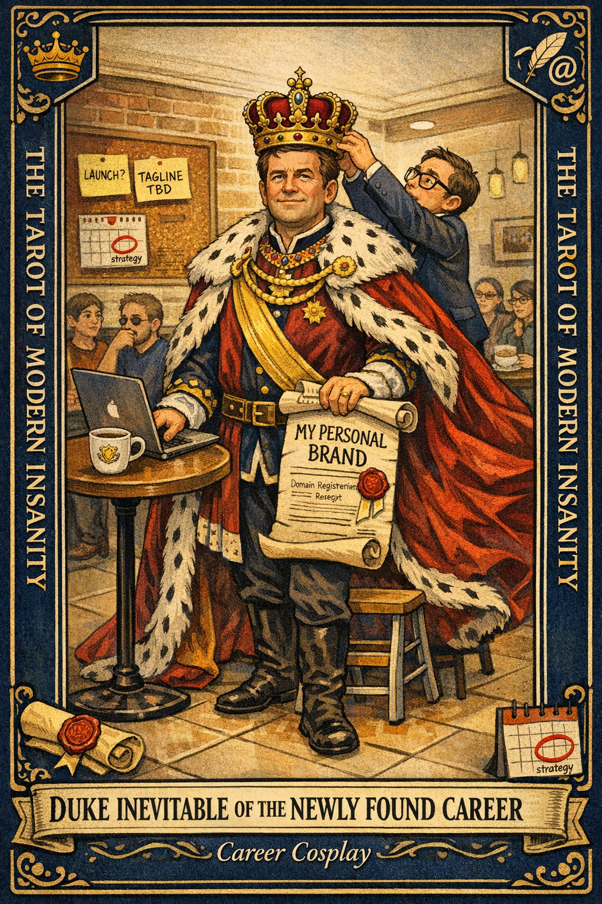

# Duke Inevitable of the Newly Found Career

## Meaning

The Duke appears when you have been staring at a new idea for six days and have already picked the outfit you will wear when it succeeds. The idea may be fine. The problem is that you have skipped past the part where anyone defines what finished looks like and gone straight to the ceremony.

Hyperfocus has found a cape, and the cape is very flattering.

## When this appears

You have rewritten your bio three times this week.

You bought a domain.

You have not written the thing, but you have written a tagline for it.

A calendar invite exists that is titled "strategy."

> "I think this is my life's work and also I started it on Tuesday."

## The Goblin Claim

> "If I cannot commit to this entirely, I am betraying my destiny."

## Reality Check

Intensity is not destiny. Intensity is a weather pattern that feels personal.

The cape is not the problem. The cape is fine. The problem is that nobody, including you, has said what the first finished thing actually is, which means the project cannot be completed, only abandoned.

A Duke without a charter is just a person in a costume in a coffee shop.

## Useful Action

Write one sentence. The sentence is: what does "done enough" look like by the end of this week?

1. Not "launched." Not "huge." Not "ready."
2. One small, boring, observable thing that proves you did a real piece of this.
3. Put it somewhere you will see it tomorrow.

Suggested phrase:

> "Your Grace, we require a deliverable, not a prophecy."

## Quote

> "A Duke without a deadline is just a person in a costume who bought a domain name on Tuesday."

## Tiny Ritual

Stand up. Take the invisible cape off your shoulders and fold it over the back of a chair. Bow slightly, to nobody in particular.

Then: water, socks, one specific sentence on a sticky note about what "done" means this week.

## Social Caption

Duke Inevitable of the Newly Found Career is what happens when hyperfocus finds a cape. The idea might be good. But if nobody has said what finished looks like, the project can only be abandoned, not completed. Write one sentence.

## Worksheet Prompt

The new thing I have decided is my destiny this week:

> _______________________________

What "done enough" looks like by Friday, in one boring sentence:

> _______________________________

What I am actually avoiding by picking up this new cape:

> _______________________________

Official ruling:

> The idea is allowed to matter. It is not allowed to skip the part where you say what finished means.
