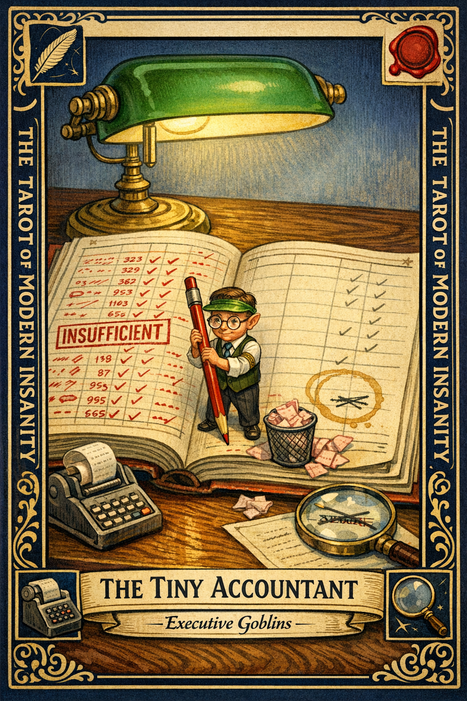

# The Tiny Accountant

## Meaning

The Tiny Accountant appears when a very small man with a very large red pen has quietly taken over your inner ledger. He itemizes every failure in triplicate and rounds every win down to zero.

He does not work for you. He works against you on your own payroll.

## When this appears

You finished three things this week and feel like you finished none.

You remember the one email you did not answer.

You do not remember the five you did.

The wins column in your head is suspiciously empty.

> "If it was easy, it doesn't count."

## The Goblin Claim

> "You did less than you think, and most of it was wrong anyway."

## Reality Check

He is not neutral. He is not fair. He is a very small accountant with a very large red pen and a deeply personal grudge.

An honest ledger has two columns. His has one, and it is written in red. The audit is rigged because the auditor only keeps receipts for the bad days.

## Useful Action

List three things you finished this week. Write them down. No qualifiers, no "but," no "sort of."

1. One work thing.
2. One life thing.
3. One small thing that still counted.

Suggested phrase:

> "Put the red pen down. The book is closed for review."

## Quote

> "You cannot balance a ledger when one side is bolded, underlined, and set on fire, while the other is written in disappearing ink."

## Tiny Ritual

Hold up three fingers. Say three things out loud that you finished since Monday. One work, one life, one small. Then: water, two minutes of walking, socks, and close the ledger for the day.

## Social Caption

The Tiny Accountant itemizes every failure and rounds every win to zero. His audit is rigged because he only keeps receipts for the bad days. List three things you finished this week. No qualifiers.

## Worksheet Prompt

Three things I actually finished this week (no qualifiers):

> _______________________________

What the Tiny Accountant keeps highlighting instead:

> _______________________________

One thing I did that I am not giving myself credit for:

> _______________________________

Official ruling:

> The ledger is allowed to exist. It is not allowed to be audited by a very small man with a very large red pen.
