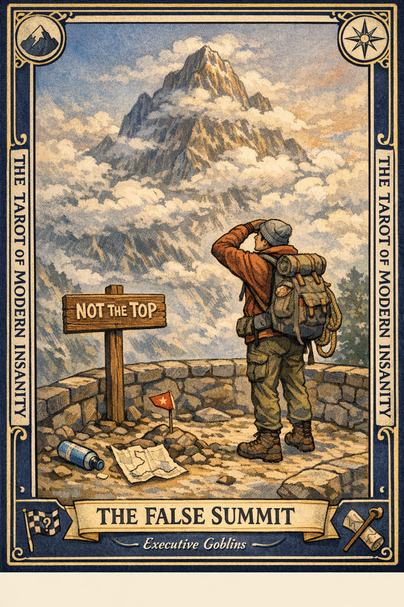

# The False Summit

## Meaning

The False Summit appears when you crest what you believed was the final ridge and discover that you were standing at the scenic overlook, not the top.

The scenery is real. The sense of finishing is not. You have not failed. You have simply been misled by hill advertising.

## When this appears

You hit the milestone. You exhale.

Then your inbox reloads.

Then Q2 opens.

Then someone says, "great, now the hard part."

> "I thought this was the end of it."

## The Goblin Claim

> "You are done. If more appears, you have already lost."

## Reality Check

You are not done. You were also not lied to. This was a checkpoint wearing the costume of a finish line, and you did real climbing to reach it.

The crash comes from the naming, not the work. Rename the hill. The legs are still good.

## Useful Action

Rename the current milestone out loud. Say what it actually is: a checkpoint, not the summit. Then pick the next checkpoint and the smallest step toward it.

1. Name what you just finished.
2. Call it a checkpoint.
3. Name the next one.

Suggested phrase:

> "This was a rest stop with a view. The top is still up there."

## Quote

> "A checkpoint in a summit costume will wear you out faster than the mountain ever could."

## Tiny Ritual

Stand up. Look at whatever wall is in front of you. Point at it and say, "Not the top." Then sit back down, drink water, and write one sentence describing the next checkpoint. Socks optional.

## Social Caption

The False Summit appears when a mid-point milestone is wearing the costume of a finish line. The view is real. The finish is not. Rename the hill. Pick the next checkpoint. The legs still work.

## Worksheet Prompt

The summit I thought I just hit:

> _______________________________

What it actually is (checkpoint, rest stop, or base camp):

> _______________________________

The next checkpoint, named honestly:

> _______________________________

Official ruling:

> You are allowed to rest at the overlook. You are not allowed to file it as the ending.
