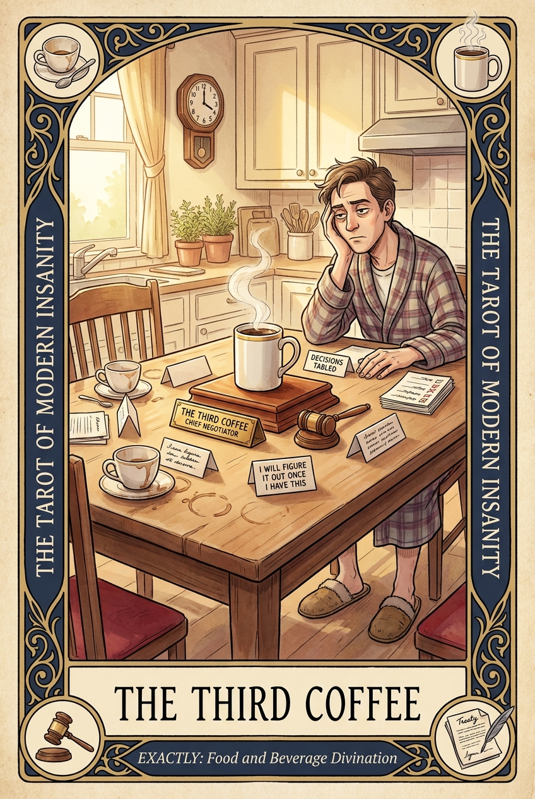

# The Third Coffee

## Meaning

The Third Coffee appears when you have stopped pursuing energy and started recruiting an entirely different person to handle your afternoon.

The first cup was breakfast. The second was work. This one is a costume. You are not caffeinating a task. You are caffeinating a decision you have not made and do not want to make yet.

## When this appears

You are standing at the pot again and it is not morning.

No new task.  
No new meeting.  
No new emergency.

Just a small hum of wanting to be somebody slightly different than the person who has to handle the next hour.

> "I will figure it out once I have this."

## The Goblin Claim

> "One more cup and I will finally know what to do."

## Reality Check

Caffeine is a real tool. It is also a beloved delay tactic wearing a performance uniform.

The third cup is not fuel. It is a small diplomatic summit you are holding with a decision you would rather not attend.

You can still drink it. Just notice the meeting on the table, and name who you were trying to avoid being for another twenty minutes.

## Useful Action

Before you pour, pause long enough to ask one honest question. Then pick the smallest next move and do that instead, or with it.

1. Name the decision you are caffeinating.
2. Write one sentence about what it actually needs.
3. Pour the coffee only if you still want it after.

Suggested phrase:

> "What am I trying to caffeinate instead of decide?"

## Quote

> "The third cup is rarely fuel. It is usually a diplomatic stall dressed in a ceramic mug."

## Tiny Ritual

Hold the empty mug in both hands like it is a small witness. Say the name of the decision you are avoiding out loud. Set the mug down. Then pick one small physical reset: water, a walk to the window, socks, sunlight, or fresh air for ninety seconds.

## Social Caption

The Third Coffee appears when you are no longer seeking energy. You are negotiating with personality. Pause before pouring. Ask what you are trying to caffeinate instead of decide. Drink it anyway if you want. Just stop pretending it is fuel.

## Worksheet Prompt

Decision I am currently caffeinating:

> _______________________________

What this decision actually needs from me:

> _______________________________

One small step I can take in the next ten minutes:

> _______________________________

Official ruling:

> You are allowed to enjoy the coffee. You are not allowed to bill it as a conclusion.
