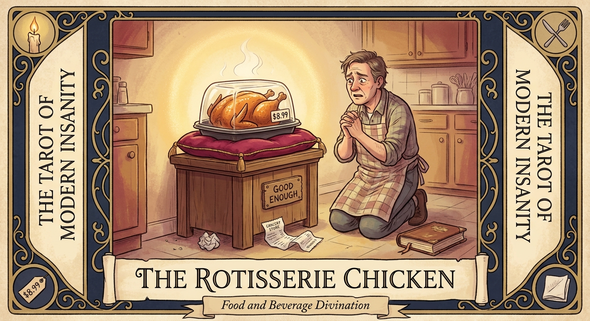

# The Rotisserie Chicken

## Meaning

The Rotisserie Chicken appears when you have a small problem and you are about to solve it with a beautiful, dignified, eight step plan that nobody asked for.

A real solution is sitting on a heat lamp under a plastic dome for nine dollars. It does not need a sauce. It does not need a strategy. It needs you to pick it up and walk to the register.

## When this appears

You are standing in the kitchen at 6:47 PM treating dinner like a dissertation defense.

No guests.  
No occasion.  
No one is grading this.  
No one is even watching.

Just a quiet panic that the meal must be earned by a sufficiently noble effort.

> "If I do not cook it from scratch, what does that say about me?"

## The Goblin Claim

> "A meal must be hard or it does not count."

## Reality Check

Effort is not the same as nourishment. Your body cannot read a recipe.

The chicken on the cushion is real food. It does not lose dignity by being convenient. You have not lowered your standards. You have stopped charging yourself a vanity tax for the crime of being tired.

The dishes you do not have to wash are not a moral failure. They are time you bought back.

## Useful Action

Tonight, give yourself permission to choose the boring fix and eat it on an actual plate, with no production value at all.

1. Pick up the rotisserie chicken, or its closest cousin.
2. Add one bagged side. No washing, no chopping, no apology.
3. Sit down. Eat the food. Stop narrating the meal.

Suggested phrase:

> "Tonight is not the audition. Tonight is the meal."

## Quote

> "Not every meal is a performance. Some nights, dinner is just heat plus chicken plus the wisdom to stop."

## Tiny Ritual

Stand over the chicken, place one hand on the lid like a humble priest, and quietly thank the bird for its service. Let it go. Let yourself be fed. Then one small physical reset: water, a slow exhale, socks, sunlight, or dim the kitchen lights.

## Social Caption

The Rotisserie Chicken appears when you are about to solve a small problem with a noble eight step plan nobody asked for. A real dinner is on a heat lamp for nine dollars. Pick the boring fix. Eat. Stop narrating.

## Worksheet Prompt

The small problem I am currently overengineering:

> _______________________________

The unglamorous fix that would actually solve it tonight:

> _______________________________

What I am afraid the easy answer says about me:

> _______________________________

What I will let myself eat without an apology:

> _____________________________