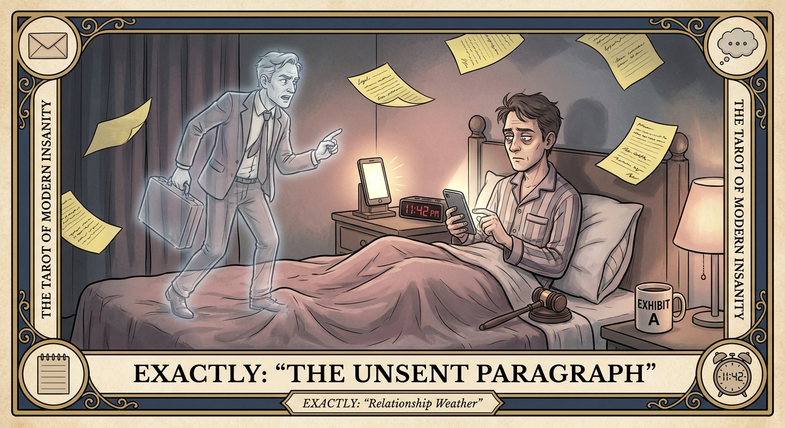

# The Unsent Paragraph

## Meaning

The Unsent Paragraph appears when you have written a 600 word closing argument in your notes app to a person who is currently watching a sitcom and has no idea you are at war.

You have built a courtroom in your phone. They are eating snacks. The case has not been served. The verdict is already drafted.

## When this appears

You are drafting your fourth version in the notes app at 11:42 PM.

No reply yet.  
No new message.  
No real fight.  
Not even a missed call.

Just a phantom lawyer pacing the edge of your bed with a legal pad and a grievance.

> "If I do not write the perfect statement, they will win the argument we have not had."

## The Goblin Claim

> "If I do not say it perfectly, I will lose this forever."

## Reality Check

The other person is not in this courtroom. They did not get the summons. They are not preparing a counter brief. They might be loading the dishwasher.

Conflict that has not been spoken is not a conflict. It is rehearsal. And rehearsal without a stage is just you, alone, getting more wound up while the other party watches a cooking show.

## Useful Action

Tonight, retire the closing argument. Send one sentence or send nothing, but do not send the brief.

1. Close the notes app. Lock the phone. Walk to another room.
2. If something must be said, say it in one sentence with no preamble.
3. If nothing must be said, wait 24 hours.

Suggested phrase:

> "I will say one thing or nothing. Not both."

## Quote

> "A grievance the other person has not heard is not a grievance. It is a rehearsal with no audience."

## Tiny Ritual

Open the notes app, select all of the unsent paragraph, and move it to a file called "court is closed." Do not delete it. Just relocate it. Then one small physical reset: water, a slow exhale, socks, sunlight, or stepping outside in the dark like a confused porch wizard.

## Social Caption

The Unsent Paragraph appears when you have drafted a closing argument to someone who has no idea you are at war. A grievance the other person has not heard is not a grievance. Send one sentence or send nothing. Not both.

## Worksheet Prompt

The paragraph I am drafting in my notes app right now:

> _______________________________

What I think it will accomplish:

> _______________________________

The one sentence version of this:

> _______________________________

What happens if I wait 24 hours and reread it:

> _______________________________

Official ruling:

> No v