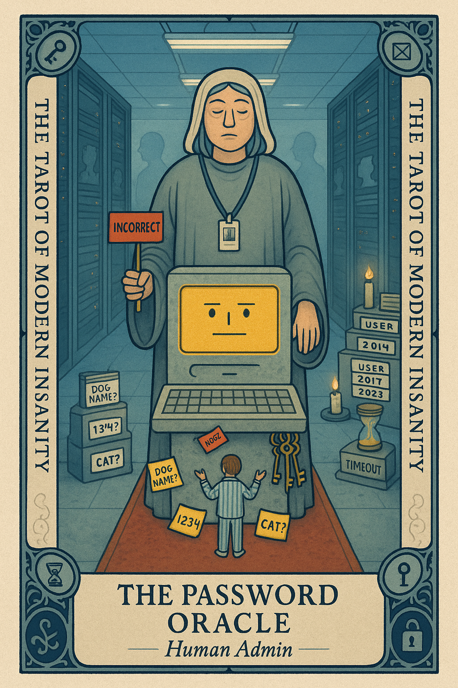

# The Password Oracle

## Meaning

The Password Oracle appears when you stand at a glowing login screen and realize you do not remember the version of yourself who made this account. A past you with different opinions about capital letters and dog names is now blocking the gate.

This card is about identity fragmentation across 200 logins, each one a tiny shrine to a self you no longer fully recognize.

## When this appears

You are typing your usual password.  
It is wrong.  
You try the older one.  
Also wrong.  
The oracle does not blink.  
You begin to wonder what kind of person made this account in 2014.

> "If I cannot get in, I am no longer real to this website."

## The Goblin Claim

> "If you cannot get in, you must not exist."

## Reality Check

The website does not contain your soul. It contains a row in a database with an email column and a hashed string. The oracle is bored.

You are not locked out of yourself. You are locked out of a streaming service from 2017 because you used a cat name your friend's cat had. Hit reset. Get a new key. Walk back inside.

## Useful Action

Reset the one password you actually need today. Not all of them. The one in front of you.

1. Click "forgot password" using the email you still control.
2. Pick a new password from your manager, or write it on paper.
3. Log in. Close the tab. Stop.

Suggested phrase:

> "I am only retrieving today's account. The other 199 are tomorrow's problem."

## Quote

> "You are not locked out of yourself. You are locked out of a streaming service from 2017."

## Tiny Ritual

Open a password manager or a fresh paper notebook. Add today's reset to it. Say out loud, "this one is filed." Then a small physical reset before the next login attempt: water, a slow stretch, socks, a window opened, two breaths near actual daylight.

## Social Caption

The Password Oracle appears when you cannot remember which past version of you made this account. The website does not contain your soul. Reset the one password you need today. The other 199 are tomorrow's problem.

## Worksheet Prompt

The account I am locked out of:

> _______________________________

The version of me who set this password (year, mood, taste in pet names):

> _______________________________

What I will do in the next ten minutes to get back in:

> _______________________________

What I will not do (reset all 199 of them):

> _______________________________

Official ruling:

> Past you was doing their best with weird taste. Reset the one and walk away. The other 199 are not on today's docket.
