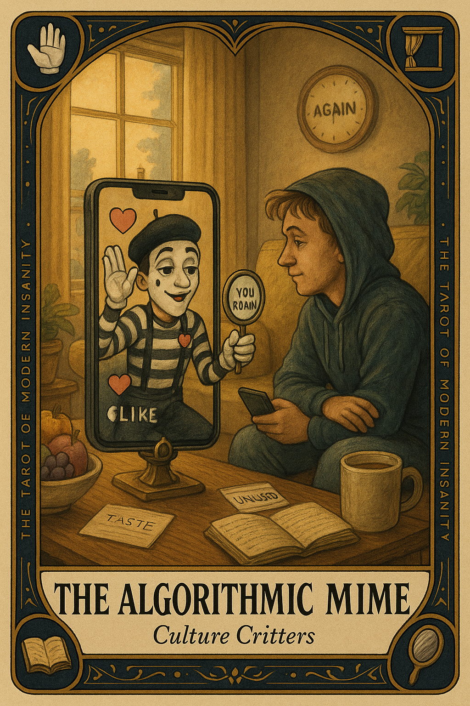

# The Algorithmic Mime

## Meaning

The Algorithmic Mime appears when your feed has stopped showing you the world and started miming a flattering caricature of yourself. It performs whatever you watched twice and calls that a personality.

You scroll, nod, feel seen, and forget that being seen by a recommendation engine is not the same as being known. The mime cannot teach you anything. It can only quote you back at yourself in slightly louder makeup.

## When this appears

You opened the app to learn something.
Three swipes in, you are watching variations of your own taste.
No new music. No surprising voice. No idea you did not already half-have.
Just your reflection in clown lipstick, dancing again.

The mime leans in and whispers:

> "This is what you like. This is who you are. Do not look away."

## The Goblin Claim

> "Your taste is so refined the world has nothing left to offer."

## Reality Check

A feed is not a window. It is a hallway of mirrors with sponsored lighting.

The mime is not malicious. It is just very good at its one job, which is to keep you here. That job has nothing to do with whether you grow.

Curiosity needs a draft of cold air now and then. Otherwise you slowly discover you have been watching the same eight thoughts for a year.

## Useful Action

Step out of the loop today. One small input the algorithm did not pick.

1. Pick one thing from outside your feed: a library shelf, a friend's recommendation, a stranger's bookmark.
2. Spend ten minutes with it.
3. Notice if your taste actually objects, or just feels surprised.

Suggested phrase:

> "I am going to read something I did not get fed."

## Quote

> "An algorithm cannot give you a taste. It can only sell you a louder copy of the one you walked in with."

## Tiny Ritual

Close the app and take down the first book you do not remember buying. Read one paragraph at random. Set the book on the kitchen table, where the algorithm cannot reach.

Then a small physical reset: water, sunlight, a cracked window, socks, three slow breaths.

## Social Caption

The Algorithmic Mime appears when your feed stops showing you the world and starts miming a flattering caricature of you. Being seen by a recommendation engine is not the same as being known. Step outside the loop. Read something you did not get fed.

## Worksheet Prompt

Three feeds I have been scrolling on autopilot:

> _______________________________

The kind of input I have not let in lately:

> _______________________________

One non-algorithmic source I will visit this week (library, bookstore, friend, stranger):

> _______________________________

What I will do if my taste objects to it instead of welcoming the surprise:

> ________