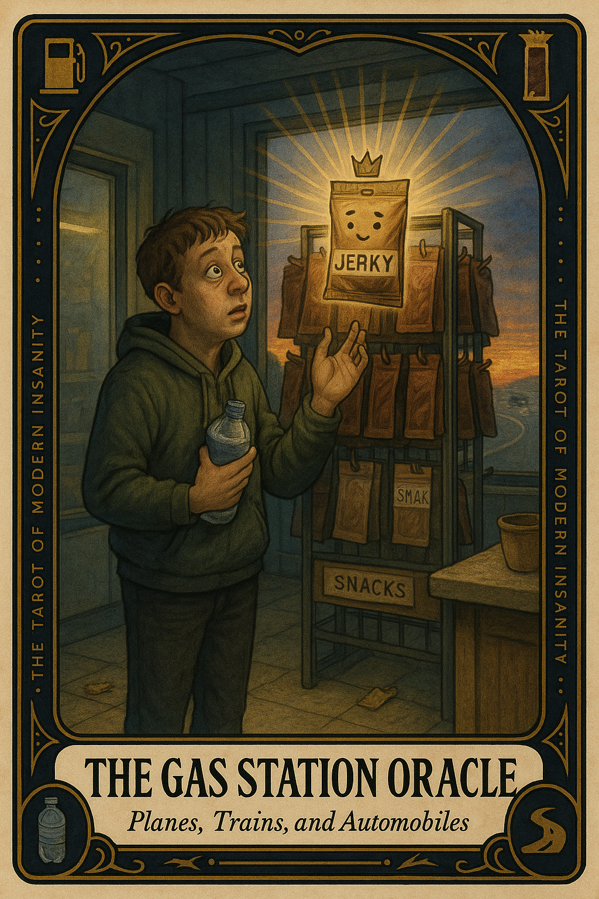

# The Gas Station Oracle

## Meaning

The world has not ended. You are simply hungry, slightly dehydrated, and forty minutes overdue for a snack. The voice in your head has been mistaking low blood sugar for cosmic verdict, and the highway is making it worse.

The Gas Station Oracle appears when your body is filing a quiet complaint and your brain decides to read it as a courtroom summons. The oracle is not wise. The oracle is jerky.

## When this appears

No catastrophe. No new bad news. Two hours since lunch. A long stretch of road and no clean exit. A small inner monologue starting to compose itself in your chest. A glowing sign in the distance offering relief that smells faintly of motor oil. Then your brain steps forward and says:

> "Maybe I have made a series of grave mistakes."

## The Goblin Claim

> "This isn't hunger. This is a structural review of your entire life."

## Reality Check

You are not in a crisis. You are in a vehicle that has been moving for a while. The body has been quietly asking for water and salt for an hour. The mind, lacking better information, decided to interpret that signal as a referendum on your character and recent decisions.

The fix is not philosophy. It is a vending machine.

## Useful Action

Pull off at the next exit. Take ten minutes. Do these in order:

1. Drink twelve ounces of water before you decide anything else.
2. Eat one snack with both salt and protein.
3. Walk one slow lap around the car before getting back in.

Suggested phrase:

> "I will reassess after the snack, not before."

## Quote

> "A snack will not save your life. But it may prevent a monologue you would have to apologize for later."

## Tiny Ritual

Get out of the car. Stand on the asphalt for thirty full seconds and let the sky exist without you narrating it. Crack the seal on a cold drink and feel the small carbonated relief. Reset with: water, salt, sky, asphalt, breath, snack.

## Social Caption

You are not in a spiritual crisis. You are forty miles past your last snack and your blood sugar is filing a complaint disguised as a cosmic verdict. Buy the chips. Drink the water. Reassess after, not before.

## Worksheet Prompt

The thing I am about to spiral about is: ______________________

The last time I ate or drank water was: ______________________

If I take ten minutes for water and a snack first, the situation looks: ______________________

What I will reassess after, not before, is: ______________________

Official ruling:

> "Hunger is not a diagnosis. Re-read the question with a snack in hand."
