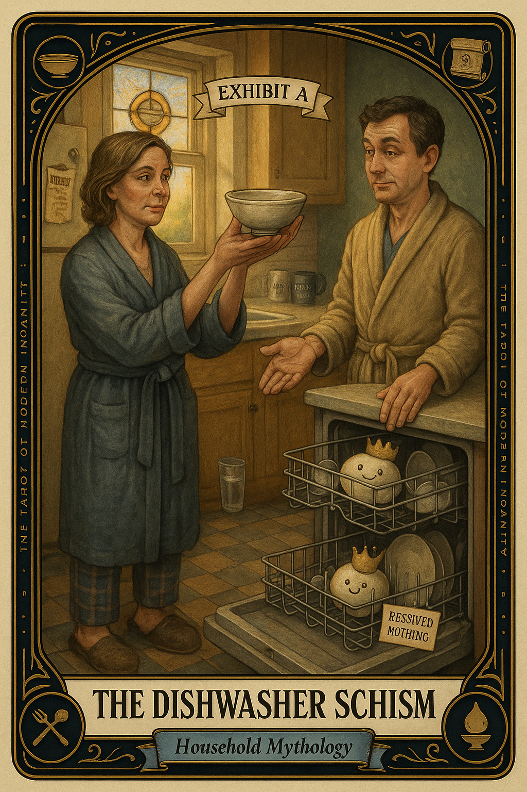

# The Dishwasher Schism

## Meaning

The dishwasher has become a holy text. There is a right way and a wrong way, and one of you is wrong, possibly forever. No one signed up to be the high priest of bowl angles, but here you are, building a doctrine in silence.

The Dishwasher Schism appears when a small operational disagreement quietly metastasizes into a referendum on respect, attention, and whether anyone in this household actually loves you.

## When this appears

A bowl loaded the wrong way. A glass on the bottom rack. A knife pointed up. No one says anything. The kettle whistles into the dead air. A righteous monologue assembles itself in your chest about every other small thing. Then the voice says:

> "If they really cared, they would know."

## The Goblin Claim

> "If they loved me, they would load the bottom rack correctly."

## Reality Check

The dishwasher is not a love language. It is a machine that handles dishes badly enough that two reasonable adults can disagree about the best workaround.

The resentment is not really about the bowl. The resentment is about a hundred small, unspoken decisions you have been carrying alone, and the bowl was simply on duty today.

The fix is not the bowl. The fix is the sentence.

## Useful Action

Say the actual sentence out loud. Once. To the actual person.

1. Pick the one specific thing that has been running an opera in your head.
2. Walk into the room they are in.
3. Say it in one sentence, with no preface.

Suggested phrase:

> "I would rather say this once than think it for a week."

## Quote

> "A clean dish is not love. A direct sentence, said once, before the resentment ferments, comes closer."

## Tiny Ritual

Open the dishwasher, look at the offending bowl, and reorient it without commentary, no sigh, no muttered prayer to a saint of dish racks. Then leave the room before you build a sermon. Reset with: water, fresh air, a different room, music, a single deep breath.

## Social Caption

The dishwasher is not a love language. It is a small machine where two reasonable adults can disagree about bowl angles, and where a week of resentment can quietly assemble. Say the sentence out loud once, before it ferments into a sermon.

## Worksheet Prompt

The bowl-angle thing I am actually angry about today is: ______________________

The deeper thing under the bowl-angle thing is: ______________________

The one direct sentence I have been quietly saving for a week is: ______________________

If I say it today, out loud, in one breath, with no preface, the worst that happens is: ______________________

Official ruling:

> "The dishwasher is fine. Say the sentence."
