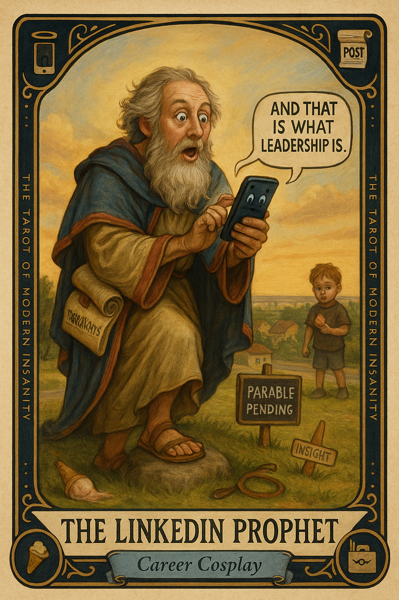

# The LinkedIn Prophet

## Meaning

The LinkedIn Prophet appears when something small and human happens, and your first instinct is to mine it for a 600-word post about resilience.

It is the urge to convert a perfectly fine Tuesday into a parable. A child drops an ice cream cone, and somewhere a man in business casual is already typing the words "and that is what leadership is."

## When this appears

You see something small.
You feel a story forming.
Your fingers twitch toward the app.

A child trips. A barista smiles. A pigeon does something faintly philosophical.

There is no audience yet. There is no insight. There is only the shape of one.

> "Someone must learn from this."

## The Goblin Claim

> "Every moment is content if you frame it correctly."

## Reality Check

The barista did not give you a free croissant to teach you about generosity in the workplace. The dog at the park did not run up to you for a 12-bullet lesson on trust.

Sometimes a thing happens. That is the whole thing.

You can witness a moment without monetizing it for a hypothetical future hiring manager.

## Useful Action

Pick one ordinary moment today and let it stay ordinary. No post. No frame. No takeaway.

1. Notice the thing.
2. Feel whatever you feel about it.
3. Resist the urge to draft a caption for an imaginary hiring manager.

Suggested phrase:

> "This was nice. It is allowed to stay nice and not be a slide deck."

## Quote

> "Not every Tuesday needs a takeaway. Some Tuesdays are just Tuesdays in a trench coat."

## Tiny Ritual

Witness one ordinary thing today and let it stay ordinary. Do not photograph it. Do not write it down. Do not tell anyone with a personal brand. Then do one small physical reset: water, fresh socks, a walk around the block, or stepping outside without your phone.

## Social Caption

The LinkedIn Prophet appears when something small happens and you start drafting a parable about it for an imaginary audience. Not every moment is content. Some moments are just a sandwich. Let one ordinary thing today stay ordinary.

## Worksheet Prompt

Today's almost-parable that nearly became a post:

> _______________________________

The mundane thing it actually was:

> _______________________________

What I felt before I tried to make it a lesson:

> _______________________________

What I will do with the moment instead of posting it for strangers:

> _______________________________

Offici