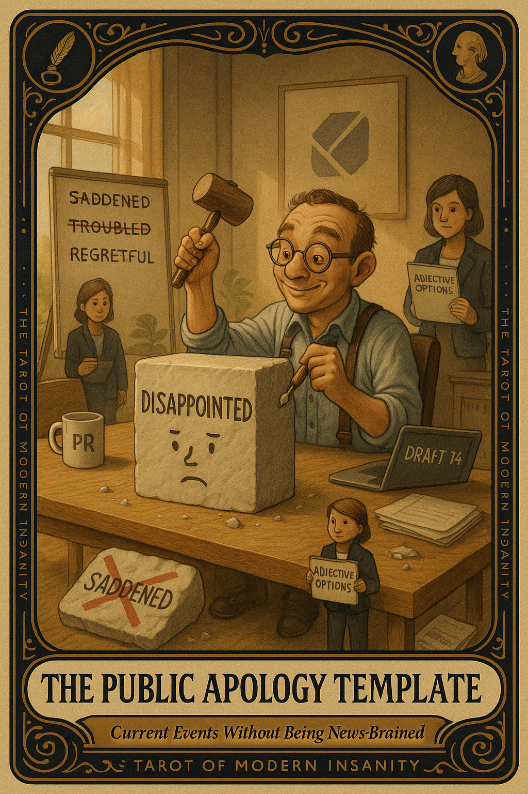

# The Public Apology Template

## Meaning

The Public Apology Template appears when a brand has been caught doing a thing and is now performing remorse using vocabulary refined by a committee.

It is the moment a logo learns to say "deeply troubled" and "fall short of our values" in the same sentence. There is no soul in the room, only an adjective consultant on retainer. The contrition is real only insofar as legal allowed it to sound that way.

## When this appears

A Notes-app screenshot lands on your timeline.
The font is white. The corners are rounded.
The first word is "We."
The third sentence contains the word "disappointed."

Strangers are already arguing in the replies about whether the apology is sincere.

> "I am being civically engaged by reading this for the fourteenth time."

## The Goblin Claim

> "If I read it one more time, I will finally understand it."

## Reality Check

A statement written by four lawyers and an adjective consultant is not a document about feelings. It is a legal artifact in a friendly font.

Re-reading it does not get you closer to the truth. It just rearranges the same fourteen approved words inside your head.

The actual event has facts. Those facts live somewhere outside the apology.

## Useful Action

Read one reliable source on the actual event. Then exit the apology discourse before it digests another hour of your life.

1. Open one news source you trust.
2. Read what actually happened, not what was said about it.
3. Close the tab on the apology screenshot. Do not forward it to friends.

Suggested phrase:

> "I have the facts now. The adjectives are not my responsibility."

## Quote

> "An apology written by committee is a press release wearing a sweater. It cannot grieve. It can only schedule."

## Tiny Ritual

Stand up, point at the screen, and say out loud:

> "You have been read. You have not been understood. You have been read."

Then do one small physical reset: water, a doorway stretch, fresh air, or putting the phone in another room for ten minutes.

## Social Caption

The Public Apology Template appears when a brand has been caught and is now performing remorse via focus-grouped vocabulary. Reading it five more times will not give you the truth. Read one trusted source on the event. Exit the apology discourse.

## Worksheet Prompt

The corporate apology I have re-read more than three times today:

> _______________________________

What I think actually happened, stripped of focus-grouped vocabulary:

> _______________________________

The one reliable news source I will read instead of the apology:

> _______________________________

What I will not do with the next ninety minutes of my one life:

> _______________________________

Official ruling:

> The apology is not the event. The discourse is not the event. Read one source. Close the tab. Go outside.
