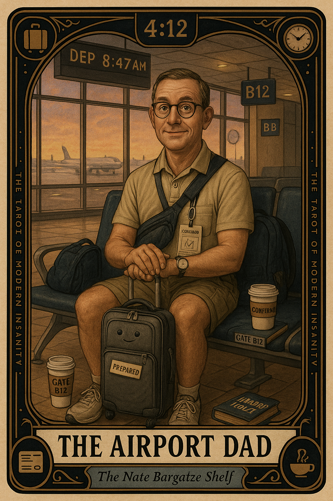

# The Airport Dad

## Meaning

The Airport Dad appears when you have decided to defeat an uncontrollable system by simply arriving before it wakes up.

He is at gate B12 at four in the morning, fed, watered, and three hours ahead of his boarding group. He has not solved the airline. He has only paid the airline in his own time so the anxiety would shut up for a little while.

## When this appears

You have packed two days early.
You have a quart bag of toiletries arranged like an exhibit.
You have boarding passes printed AND on the phone AND screenshotted.
The trip is in eleven hours.

> "If I am at the airport, the airport cannot happen TO me."

## The Goblin Claim

> "If we get there early enough, nothing bad can happen."

## Reality Check

Arriving four hours early does not control the flight. It controls one of your fears for one of the four hours.

The TSA line, the weather in Denver, the gate change, the kid behind you kicking the seat. They all still exist. You have just bought yourself extra time to sit in fluorescent light worrying about them.

Preparation is real. Hyperpreparation is anxiety wearing a fanny pack.

## Useful Action

Arrive a reasonable amount early. Spend the saved hour on a book, not on a stomach.

1. Pick a real arrival time: 90 minutes domestic, 2 hours international.
2. Bring one book or one podcast you actually want.
3. Eat the airport sandwich without ranking it.

Suggested phrase:

> "I have arrived. The airport will do its own job."

## Quote

> "You cannot defeat logistics by arriving early. You can only sit inside the logistics for a longer period of time."

## Tiny Ritual

Sit down at the gate. Open the book you packed. Look up only when the group before yours is called. The system will run without your supervision.

Then do one small physical reset: water, a slow walk to the bathroom, sunlight at a window, or sixty seconds of outside weather.

## Social Caption

The Airport Dad appears when you decide to defeat an uncontrollable system by arriving before it wakes up. Arriving four hours early does not control the flight. It just buys you more fluorescent-lit hours to worry. Bring a book. Eat the sandwich.

## Worksheet Prompt

The trip I have started rehearsing in my head three days early:

> _______________________________

The thing about this trip I can actually control versus the things I cannot:

> _______________________________

A reasonable arrival time, measured in hours rather than fear:

> _______________________________

The book, podcast, or snack I will bring as an alternative to pacing:

> _______________________________

Offi