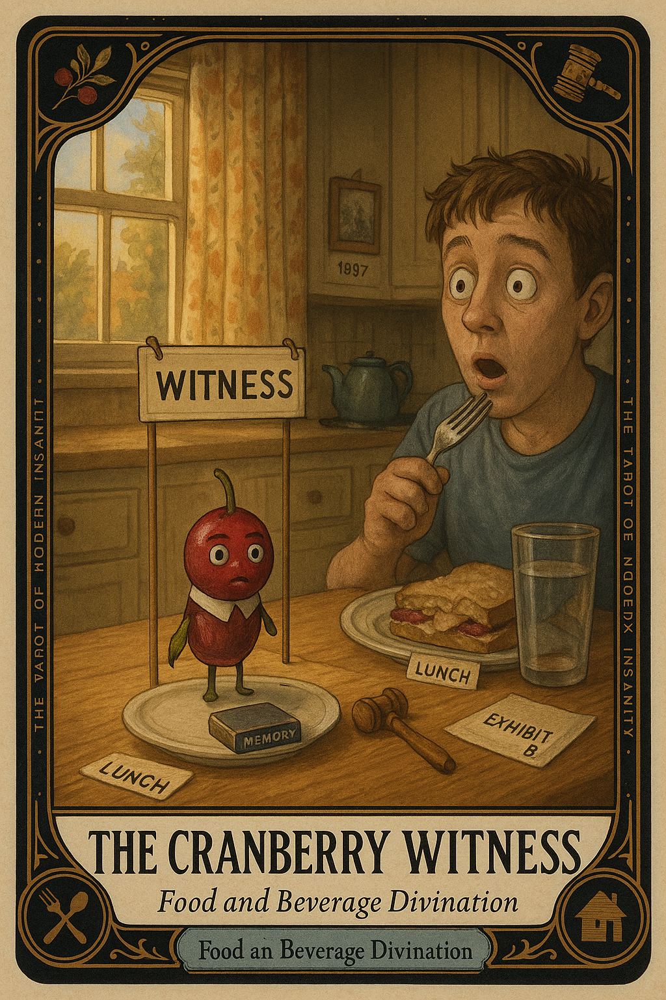

# The Cranberry Witness

## Meaning

The Cranberry Witness appears when a flavor walks into your mouth uninvited, sits down, and begins asking questions about Thanksgiving 1997. You did not summon this. You ate a sandwich.

The cranberry on it has now subpoenaed your entire family history, the kitchen floor of a house your grandparents no longer own, and the exact wallpaper in the dining room. The witness is sworn in and you are crying.

## When this appears

You bite into something ordinary.
A wave hits without warning.
You are seven years old standing in a doorway.
A song plays in your head that you have not heard since 2003.
You blink. The sandwich is still a sandwich. The kitchen is still your kitchen.

> "Why is this happening at lunch."

## The Goblin Claim

> "If a flavor made you cry at lunch, something is wrong with you."

## Reality Check

Nothing is wrong with you. You have a working sensory archive and a mostly functional grief filter. They occasionally collaborate without filing paperwork.

A flavor is a knock at the door. It is not a verdict on your life. It is a small object asking if you remember a kitchen, a person, a Tuesday.

Answer or don't. The cranberry leaves either way.

## Useful Action

Let the feeling sit at the table for one minute without performing for it.

1. Pause for sixty seconds. Do not narrate it to anyone in the room.
2. Name what it reminds you of, out loud or in your head: a person, a place, a year.
3. Take one breath. Eat the rest of the sandwich.

Suggested phrase:

> "I see you. You can stay for a minute. Then I am finishing my food."

## Quote

> "Memory is allowed to visit at lunch. It does not have to take over the whole table."

## Tiny Ritual

Place one hand on the table. Say, out loud or under your breath, the name of the room you are remembering, then the year. Let it land. Then pick up the fork.

After: water, sunlight on the back of your neck, a slow walk past a window, or socks.

## Social Caption

The Cranberry Witness appears when an unrelated flavor subpoenas your entire family history at lunch. Nothing is wrong with you. A flavor is a knock at the door, not a verdict. Let the feeling sit for a minute, then finish your food.

## Worksheet Prompt

The flavor that ambushed me today:

> _______________________________

The room, year, or person it took me back to:

> _______________________________

What I want to say to that memory in one sentence:

> _______________________________

What I will do for the rest of this meal, after letting the witness speak:

> _______________________________

Official ruling:

> The witness is allowed in the room. The witness does not get to run the room.
