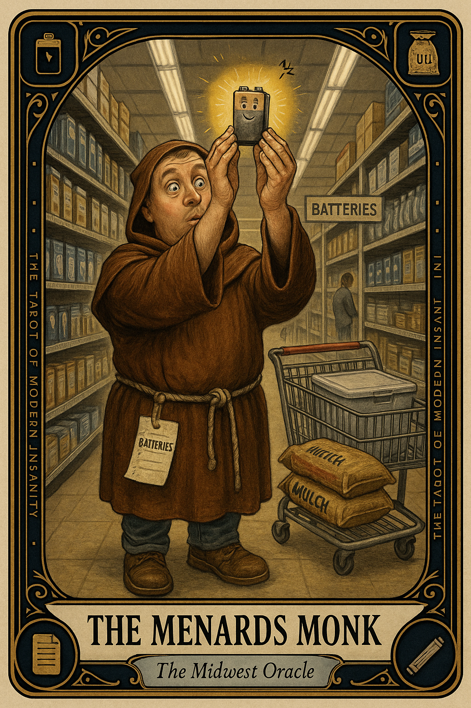

# The Menards Monk

## Meaning

You came in for batteries. You leave with three new philosophies, a bag of mulch you don't need, and a quiet sense that you have been chosen.

Menards is a vortex shaped like a building. Faced with eight aisles of insulation, your brain has dissociated into a robed figure meditating on the deep moral implications of a 9-volt under fluorescent lights.

## When this appears

You walked in with a list of one item.
You are now in aisle 14.
The lights have not changed in 30 minutes.
A man named Gary just nodded at you with reverence.
You have considered seven types of grout.
You did not know there were seven types of grout.

> "Maybe I should rethink the whole house."

## The Goblin Claim

> "If I buy enough hardware, I will become a different man."

## Reality Check

You did not need a chest freezer. You needed batteries.

The store is designed to convert errands into identities. It works because warehouses are spiritually destabilizing and you are a small person standing under a 40-foot ceiling, holding a single light bulb, asking the universe questions.

Buy the batteries. Leave with the batteries. The freezer will still be there next week.

## Useful Action

Before you walk in:

1. Write the list before leaving the house. Three items max.
2. Set a 20-minute timer on your phone before crossing the threshold.
3. If a thought begins with "while I'm here," redirect it to a notes file labeled "next time."

Suggested phrase:

> "I came for batteries. The mulch philosophy can wait until the drive home."

## Quote

> "A warehouse is not a temple. The mulch is not a sign. You came for batteries. Leave with batteries."

## Tiny Ritual

Before entering, point at the building from the parking lot and say out loud, "I am one man. I have one list." Then do one small physical reset: water, fresh air, a snack from a known package, sunlight, or sitting in the truck for 90 seconds before going in.

## Social Caption

The Menards Monk appears when you came in for batteries and leave with mulch philosophy. The warehouse is not a temple. Your errand is not a calling. Write the list, set the timer, leave with what you came for.

## Worksheet Prompt

Item I actually came in for:

> _______________________________

Items I am about to put in the cart that were not on the list:

> _______________________________

What I am actually trying to fix in my life by buying these things:

> _______________________________

Honest answer about whether I will use them:

> _______________________________

Official ruling:

> Buy the original list. Make a "next time" note for the rest. The mulch philosophy will keep until the drive home.
