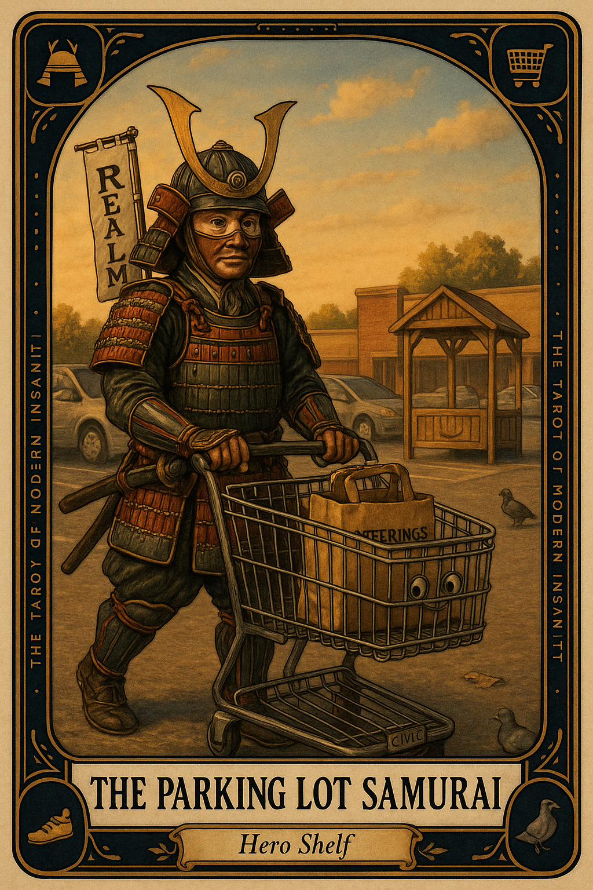

# The Parking Lot Samurai

## Meaning

The Parking Lot Samurai appears when you do a small good thing and nobody claps. You returned the cart. You picked up the wrapper. You held the door for the person three feet behind you who said nothing.

The card asks whether you are willing to do tiny acts of decency that produce no ROI, no LinkedIn post, and no medal. It is the patron card of unrewarded virtue.

## When this appears

You are alone in a parking lot.
The cart corral is forty feet away.
Nobody is watching.
Your spot is paid. Your groceries are loaded.
The wind is doing weather.
You could leave the cart and nobody would know.

> "It will be fine. Someone is paid for this."

## The Goblin Claim

> "Tiny good deeds don't matter. Nobody is keeping score anyway."

## Reality Check

The point is precisely that nobody is keeping score.

A society held together by witnessed virtue is not a society. It is a stage. The cart return is a rep. The unwitnessed kindness builds the muscle. The medal is the work.

You are not auditioning to be a good person. You are practicing being one when nobody is watching.

## Useful Action

Do one small unrewarded act today. Do not announce it. Skip the photo, skip the LinkedIn post, skip the slight pause that asks for thanks.

1. Pick something low-stakes (return the cart, pick up the wrapper, hold the door).
2. Do it without commentary, performance, or witness.
3. Walk away. Get in the car. Continue your day.

Suggested phrase:

> "The realm remembers."

## Quote

> "Virtue practiced for an audience is performance. Virtue practiced for nobody is the actual thing."

## Tiny Ritual

The next time you are alone and could leave a small mess for the next person, do not. Pick up one cup. Push in one chair. Return one cart. The realm does not need you, but it logs you anyway: water, walk, fresh air, sunlight.

## Social Caption

The Parking Lot Samurai appears when you do a small good thing and nobody claps. The unwitnessed kindness is the actual rep. Return the cart. Pick up the wrapper. The realm remembers, even if nobody else does.

## Worksheet Prompt

The small unwitnessed act I am low-key avoiding today, the one nobody will notice if I skip:

> _______________________________

Why I keep waiting for someone to notice my regular decency:

> _______________________________

The version I will do anyway, without announcement, photo, or commentary:

> _______________________________

Official ruling:

> The cart goes in the corral whether or not anyone is watching. The realm logs the rep regardless. That is the entire deal.
