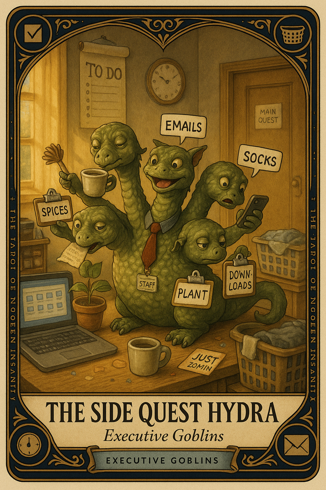

# The Side Quest Hydra

## Meaning

The Side Quest Hydra appears when you have done seventeen things today, all of them small, and the one thing that matters is still untouched. You alphabetized your downloads. You replied to a six-day-old text. You did not draft the proposal.

The hydra grows a new head every time you finish one of its other heads. The main quest, meanwhile, sits in a different room politely waiting.

## When this appears

You opened the laptop to do the thing.
You are now reorganizing a spice drawer.
You answered three emails that did not need answering.
You are watering a plant that is doing fine.
The thing remains undone.
The drawer looks great.

> "Surely momentum on anything counts as momentum."

## The Goblin Claim

> "Side quests are real quests if I squint hard enough."

## Reality Check

A hydra with no main quest is just a list. A hydra with a main quest you are dodging is avoidance with extra paperwork.

The work that has consequences is the work the brain pretends not to see. Side tasks are warm and finite. The main quest is cold, unfinished, and stares back.

You are not bad. You are just choosing the heads that bite less.

## Useful Action

Name the main quest out loud. Then do ten minutes of it before any other head gets fed.

1. Say the main quest in one sentence, plainly, without negotiation.
2. Set a 10-minute timer and work on it only.
3. After the timer, choose the next head with eyes open.

Suggested phrase:

> "The main quest is the one I keep walking past."

## Quote

> "If everything on your list is getting done except the thing that matters, the list is the costume."

## Tiny Ritual

Stand up. Point at where the main quest lives. Say:

> "I see you."

Sit back down and do one 10-minute slice. Do not negotiate, do not stretch it, do not declare the day a wash if you only do ten. Reset: water, walk, fresh air, daylight.

## Social Caption

The Side Quest Hydra appears when you've done seventeen small things and the one with consequences is still untouched. Side tasks are warm and finite. The main quest is cold and stares back. Do ten minutes of it before any other head gets fed.

## Worksheet Prompt

The main quest I have been walking past today, named plainly:

> _______________________________

The side quests I am using to feel productive while not doing it:

> _______________________________

The 10-minute slice I will do before any other head gets fed:

> _______________________________

Official ruling:

> A list of finished things does not protect you from the one unfinished thing. The hydra grows new heads. Cut the one that matters first.
