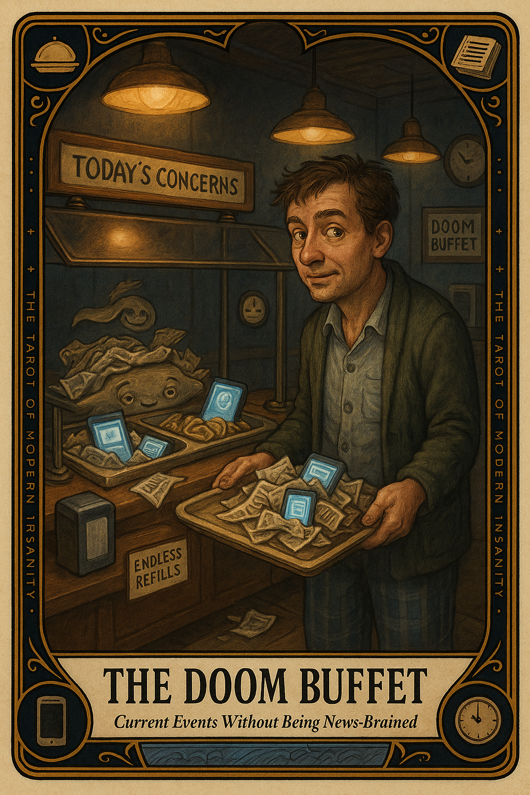

# The Doom Buffet

## Meaning

The Doom Buffet appears when you sit down for one news headline and stand up two hours later with stomach fog and no new knowledge. You came for context. You left with a vague nausea, a soft conviction the world is ending, and zero useful information.

The buffet is open all night. The food is bad. Your tray is full and you cannot remember eating.

## When this appears

You opened the phone to check the time.
You are now twenty tabs deep on a war you cannot end.
No new facts. No new actions. No new permission to feel anything.
Just dread, lightly buttered.
Your thumb keeps scrolling.
Your jaw is doing something it does not normally do.

> "If I keep reading, surely something useful will appear."

## The Goblin Claim

> "Staying upset is the same as staying informed."

## Reality Check

Being informed is a doorway. Doom-scrolling is standing in the doorway for six hours staring at the same hinge.

You can know what is happening in the world without eating a fourth helping of someone else's worst day. The buffet is not making you wise. It is making you tired and slightly worse at being a person.

Information has a useful dose. The dose is small.

## Useful Action

Read one source you trust for ten minutes. Then put the phone down.

1. Pick one outlet you actually respect. One. Not three.
2. Read for ten minutes flat. Set a timer if your hand will not cooperate.
3. Close every other tab. Walk away from the buffet without looking back.

Suggested phrase:

> "I am informed enough for one human."

## Quote

> "Being informed is a small task. Doom-scrolling is the costume that task wears when it has been left alone too long."

## Tiny Ritual

Close the news app. Physically walk into a different room than the phone is in. Stand there for ninety seconds and look at one ordinary object that exists in real life. Reset: water, sunlight, fresh air, a hand on something cold.

## Social Caption

The Doom Buffet appears when you came for context and left with stomach fog. Doom-scrolling is not the same as being informed. Read one source you trust for ten minutes, then close the tabs and walk away from the buffet.

## Worksheet Prompt

The piece of news I keep refreshing even though no new information has appeared in hours:

> _______________________________

The feeling I am hoping to fix by reading one more headline:

> _______________________________

The one source I actually trust, the one I will read for ten minutes today:

> _______________________________

Official ruling:

> Information is a doorway, not a residence. Read one trustworthy source. Then close every tab and walk away from the buffet.
