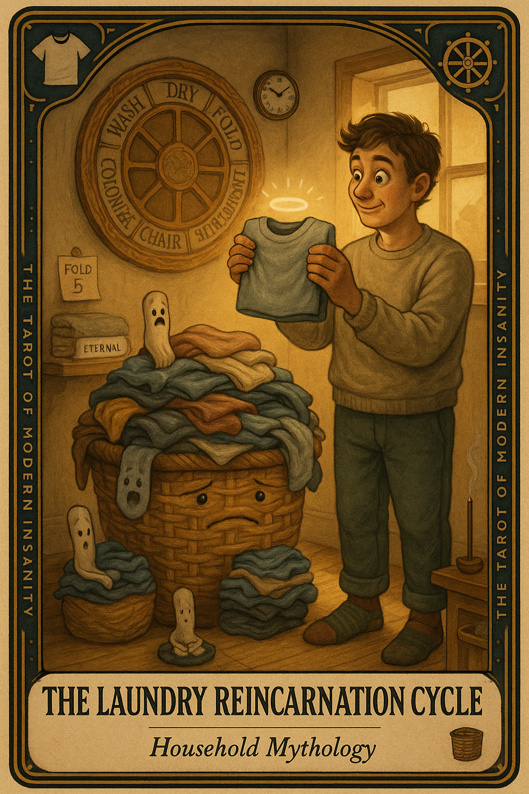

# The Laundry Reincarnation Cycle

## Meaning

The Laundry Reincarnation Cycle appears when your clothes are technically clean but living a second life as furniture. They have been washed, dried, folded only in your imagination, and reborn as ambient room geography.

The wheel turns. Nothing is dirty, nothing is put away, and somewhere deep in the basket a sock is starting to believe it lives there now and pays rent.

## When this appears

You walk past the basket again.

The towels look familiar.  
The shirts are warm but settled.  
You think you washed these on Tuesday.  
You think it is now Saturday.

Your nervous system hums:

> "If we ignore them, they may complete the cycle on their own."

## The Goblin Claim

> "These will fold themselves if I give them enough silence."

## Reality Check

The clothes are clean. That part is done. The work that remains is small, boring, and entirely physical.

The hard part of laundry was never the washing. It was the deciding where each thing belongs and putting it there.

Re-folding is not a punishment. It is just the last move in a game you have already won most of.

## Useful Action

Fold five items. That is the entire task. Do not unpack the basket. Do not start a load.

1. Pull five things out of the basket or pile.
2. Fold or hang each one.
3. Put those five away in their actual home.

Suggested phrase:

> "I am not catching up on laundry. I am freeing five clothes."

## Quote

> "Clean laundry that lives in a basket is not laundry. It is a small fabric ghost town with opinions."

## Tiny Ritual

Walk to the basket. Place one hand on top of it like a priest blessing a confused parishioner. Say out loud, "You have been clean long enough." Pull out five items and put them away. Then: water, shower, socks, sunlight, fresh air.

## Social Caption

The Laundry Reincarnation Cycle appears when your clean clothes start living a second life as furniture. The hard part is not the washing. It is the putting away. Fold five items today. That is the entire assignment.

## Worksheet Prompt

The basket has been sitting in the corner since:

> _______________________________

The reason I keep walking past it without folding:

> _______________________________

Five items I am willing to free from purgatory today:

> _______________________________

Where each of those five actually lives in this house:

> _______________________________

Official 