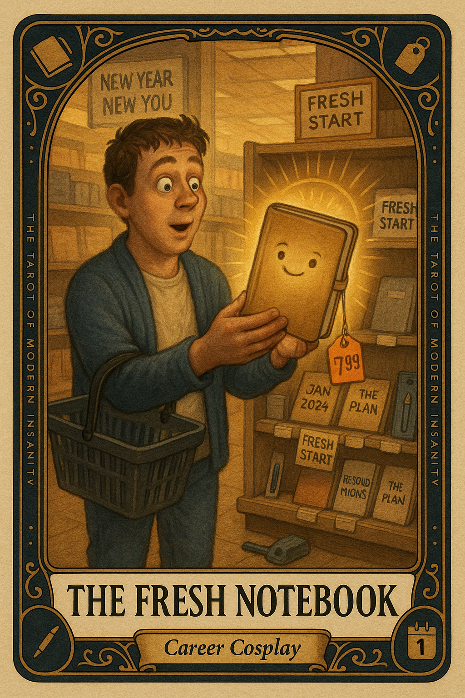

# The Fresh Notebook

## Meaning

The Fresh Notebook appears when you have purchased a future that does not exist yet. It is the moment a $7.99 piece of cardboard convinces you that the cleaner, more focused version of you is finally about to clock in.

That version is not in the notebook. The notebook is the diving board. The pool is the part where you actually write the first line.

## When this appears

You are standing on the stationery aisle, slightly elated.

No project started.  
No deadline.  
No first sentence.  
No actual pen in hand.

Just a fresh cover, a fresh smell, and your nervous system whispering:

> "This one. This one is going to fix me."

## The Goblin Claim

> "If the notebook is right, the life will follow."

## Reality Check

A notebook is not a life change. A notebook is a small paper box that holds proof you tried.

The reason the old notebook is unfinished is not because it was the wrong color or the wrong brand. It is because writing in it requires sitting down and being a person, which a new cover cannot do for you.

## Useful Action

Open the notebook you already own. The slightly disappointing one. Then:

1. Write today's date on the first blank page.
2. Write one sentence. Any sentence. A grocery list counts.
3. Close it. Walk away.

Suggested phrase:

> "I do not need a new container. I need a single line."

## Quote

> "A notebook is a promise. A sentence is a payment. The clearance shelf accepts neither."

## Tiny Ritual

Hold the notebook in both hands and say out loud: "I see you, paper rectangle. You are not my savior." Then write one boring sentence inside it. Reset with something small: water, the pen already on the counter, socks, sunlight, or briefly stepping outside like a person who actually owns this notebook.

## Social Caption

The Fresh Notebook appears when you buy a new life for $7.99 and call it preparation. The notebook is not the project. Open the one you already own and write one sentence in it today. Any sentence. A grocery list counts.

## Worksheet Prompt

The notebook I just bought was supposed to finally make me into:

> _______________________________

The project actually waiting for me is:

> _______________________________

One sentence I could write today in any notebook already in the house:

> _______________________________

Official ruli