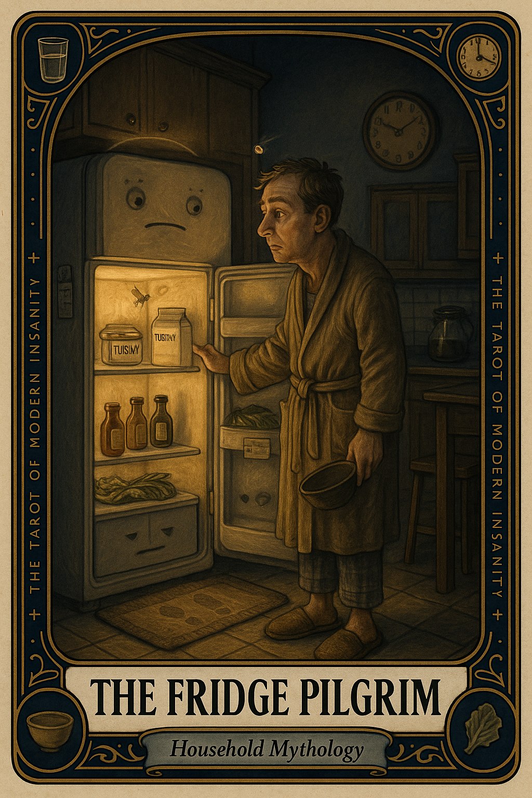

# The Fridge Pilgrim

## Meaning

The Fridge Pilgrim appears when you walk to the kitchen, open the cold glowing box, see the same five items that were there twenty minutes ago, and walk away.

It is not hunger. It is a small ritual of restlessness wearing the costume of a snack. The fridge has not changed. You are checking on the contents of your own nervous system.

## When this appears

You have visited the fridge three times in twenty minutes.

No new groceries.  
No new appetite.  
No new mystery bowl behind the leftovers.  
No real news at all.

Just you, the cold light, the gentle hum, and a small voice whispering:

> "Maybe this time it will be different."

## The Goblin Claim

> "If I stare long enough, food I love will appear."

## Reality Check

A fridge is a small refrigerated archive, not an oracle. It reports what is there. It does not negotiate.

What you are actually looking for is usually water, a real meal, a break, or a feeling you do not want to name.

The cold air is a small dopamine receipt. The yogurt is not a personality fix.

## Useful Action

Step away from the cold altar. Then:

1. Drink a full glass of water, slowly.
2. Set a five minute timer and do one small thing that is not eating.
3. When the timer rings, ask out loud: am I actually hungry, or am I trying to feel something?

Suggested phrase:

> "The fridge is closed. The question is open."

## Quote

> "The fridge is not a mirror. It will not show you what you are looking for."

## Tiny Ritual

Stand in front of the closed fridge, place one hand on the door like a humble visitor, and say: "Nothing has changed since the last visit." Then perform one small reset that is not opening the door again: water, shower, socks, sunlight, or a slow walk past a window.

## Social Caption

The Fridge Pilgrim appears when you check the cold shrine for the fourth time in an hour and find nothing has changed. It is not hunger. It is restlessness wearing a snack costume. Drink water. Wait five minutes. Then ask the real question.

## Worksheet Prompt

The feeling I was trying to feed at the fridge:

> _______________________________

What I actually need right now, said plainly (water, rest, contact, a real meal, nothing):

> _______________________________

One small non-food thing I can do for myself in the next ten minutes:

> _______________________________

The next real meal I have already planned, even loosely:

> _______________________________

Official ruling:

> The fridge is allowed to be empty. So are you, for a few minutes. Neither of you is broken.
