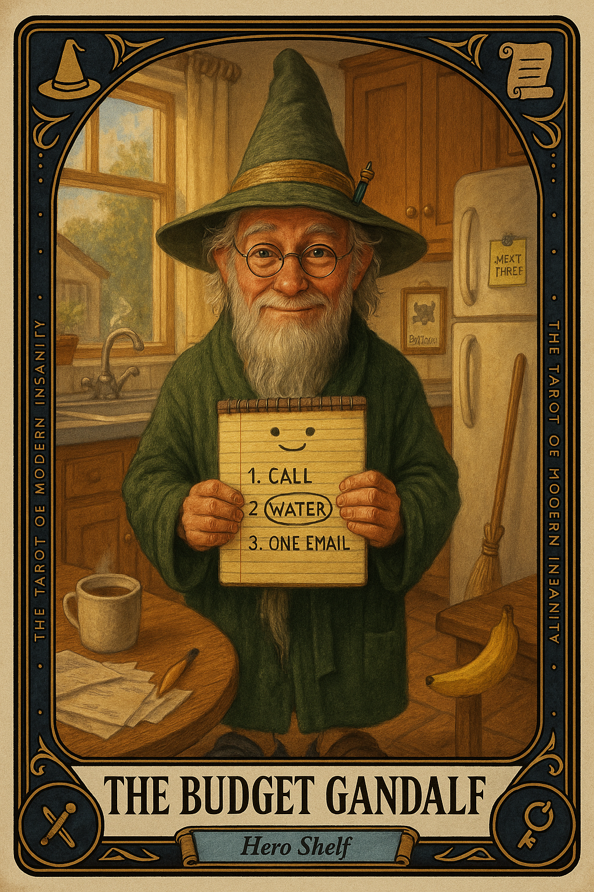

# The Budget Gandalf

## Meaning

The Budget Gandalf appears when the situation is too large, too political, or too on fire for any single person to fix, and your nervous system asks if you would like a strategy meeting with yourself.

He is not the wizard from the books. He is the off brand version, standing in your kitchen with a legal pad and a free pen from a credit union. His magic is small, real, and entirely list shaped.

## When this appears

You are staring at something you cannot fix in one move.

A bill.  
A diagnosis.  
A flood of work.  
A relationship you do not know how to enter, exit, or repair.

You are not lazy. You are scaled wrong for the problem. A small voice behind your ear says:

> "We need a plan, and we need it before lunch."

## The Goblin Claim

> "If I cannot fix the whole thing, I have done nothing."

## Reality Check

You cannot defeat the Balrog. The Balrog is a tax bracket, a chronic condition, a slow election, an aging parent.

But you can make a list. The list is not the rescue. It is a rope bridge that holds you for the next ten feet.

Heroes in stories swing swords. Heroes in real life write down three things and start with the one that takes a phone call.

## Useful Action

Write the next three things. Not the plan. Just the next three things.

1. Get any paper, including a receipt.
2. Write the next three actions within reach today, no matter how small.
3. Circle the smallest one and start it within ten minutes.

Suggested phrase:

> "I am not solving this. I am moving it three inches."

## Quote

> "The Balrog is not yours to defeat. The list is yours to write. Pick up the pen."

## Tiny Ritual

Pick up any pen. Hold it like a small staff. Say to the kitchen, the room, the laundry, the air:

> "You shall not pass uncatalogued."

Then do one small physical reset that proves you are still in your body: water, shower, socks, sunlight, or three slow steps to a window.

## Social Caption

The Budget Gandalf appears when the problem is too large for one move and you are still expected to do something today. You cannot defeat the Balrog. You can write the next three things. Pick up the pen. Move it three inches.

## Worksheet Prompt

The thing currently too large to fix in one move:

> _______________________________

Three actions within reach today, no matter how small:

> _______________________________

Which of the three is the actual smallest, said honestly:

> _______________________________

The ten minute window I will use to start it:

> _______________________________

Official ruling:

> You are not failing. You