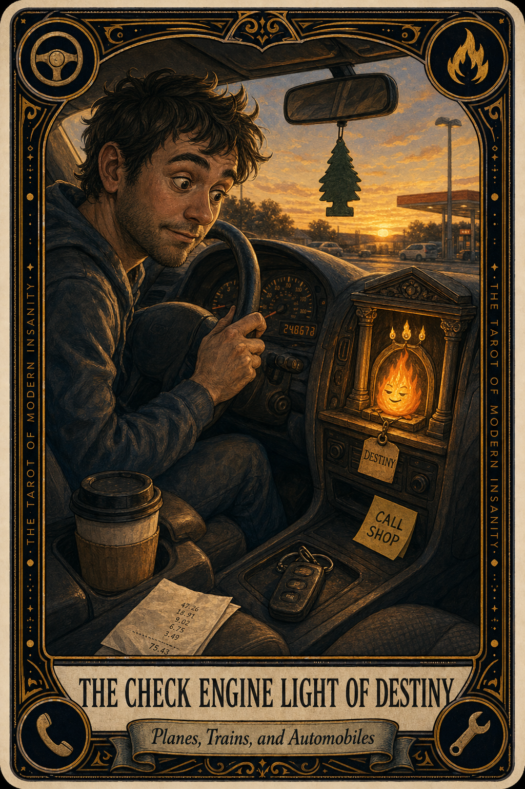

# The Check Engine Light of Destiny

## Meaning

The Check Engine Light of Destiny appears when a small orange symbol on your dashboard becomes a personality you have decided not to talk to. You acknowledge it. You greet it on Tuesday. You greet it on Friday. You let it ride.

The car has entered the conversation, and you have responded by turning up the radio.

## When this appears

You see the light.  
You assess the light.  
You assign the light a vibe.  
You decide the vibe is "fine for now."  
You have been deciding this for three weeks.

Then your nervous system, very politely, whispers:

> "The light is talking. We are pretending it is furniture."

## The Goblin Claim

> "If we ignore it long enough, it becomes a feature."

## Reality Check

A blinking sensor is not a curse. It is a small voice asking for a small appointment.

The thing about small warnings is they almost never get smaller. They wait, then they invoice you in a parking lot at 9 PM in the rain.

You do not have to diagnose anything. You only have to make the call.

## Useful Action

Book the appointment before you finish reading this card. One call, one slot. That is the whole task.

1. Open your phone.
2. Call or message your shop. Take the first slot they offer.
3. Write the date somewhere you will actually see it tomorrow.

Suggested phrase:

> "I am not the mechanic. I am the person who calls the mechanic."

## Quote

> "The check engine light is rarely lying. It is just very bad at small talk and very good at waiting."

## Tiny Ritual

Walk out to your car. Place one hand on the hood. Say, out loud, with mild dignity:

> "I have heard you."

Then do one small physical reset: water, fresh socks, a short walk, sunlight on your face, or a glass of something cold.

## Social Caption

The Check Engine Light of Destiny is the small warning you keep greeting like a coworker you owe an email. It is rarely lying. It is just bad at small talk. Book the appointment today.

## Worksheet Prompt

The warning I have been politely ignoring is:

> _______________________________

What I am afraid it will cost in money or dignity:

> _______________________________

The smallest next step (one call, one tap, one shop name written down):

> _______________________________

What I will say to the person on the other end of th