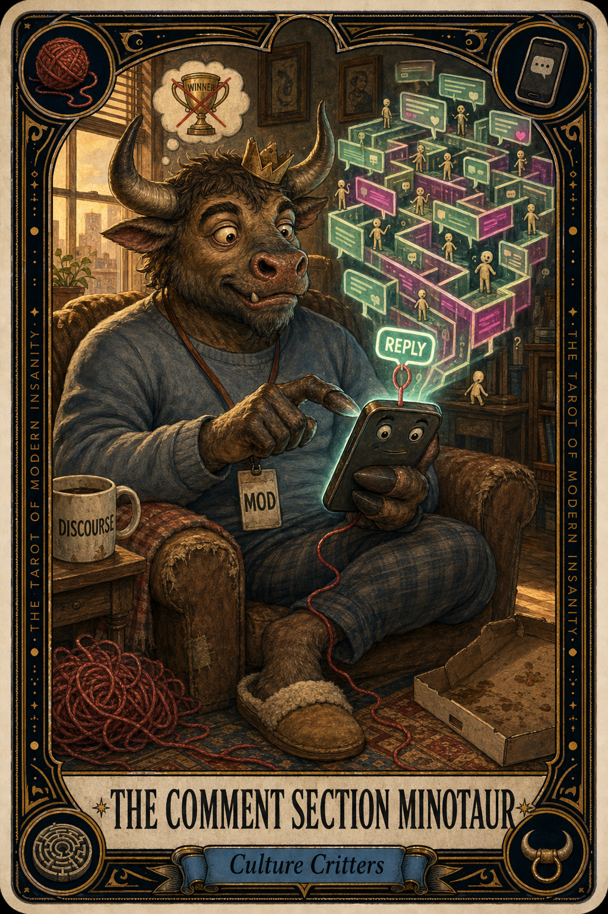

# The Comment Section Minotaur

## Meaning

The Comment Section Minotaur appears when you click on a thread for a quick scan and end up two hours deep, typing a paragraph you will never post to a stranger you will never meet.

It guards a glowing labyrinth of opinions, each corner promising one more turn until you finally reach the truth. There is no truth in here. There is only a beast.

## When this appears

You opened the app to check one thing.

No one is wrong about you specifically.  
No one has asked your opinion.  
No one will remember this thread tomorrow.  
No one is winning.

Just your finger hovering above the reply button while your nervous system whispers:

> "But what if I said it really well."

## The Goblin Claim

> "If I say this perfectly, the labyrinth will finally have a winner."

## Reality Check

There is no winner. The labyrinth is the product. Your attention is the meat.

The minotaur is not a person you can defeat with a better argument. It is the architecture of the platform itself, designed to keep you walking and snorting at shadows.

You can be right and still be lost in there.

## Useful Action

Close the tab and let the unsaid response live in a notes file instead. Nothing happens out there today that requires your participation.

1. Stop typing mid-sentence.
2. Open a notes file. Paste what you were going to say.
3. Close the original thread. Do not refresh it.

Suggested phrase:

> "The minotaur eats every reply. Mine is going in the freezer."

## Quote

> "You did not enter the comment section to find truth. You entered to feed something that is never full."

## Tiny Ritual

Stand up. Walk to a window. Tell the glass:

> "I am not arguing with a stranger today."

Then do one small physical reset: water, sunlight, the cold side of the pillow, or putting your hand on a real plant.

## Social Caption

The Comment Section Minotaur appears when you mistake a thread for a conversation. The labyrinth is the product. Your attention is the meat. Close the tab. The reply you would have written will live longer in a notes file than it ever will in the feed.

## Worksheet Prompt

The thread I am about to enter:

> _______________________________

What I want to prove and to whom:

> _______________________________

What entering the labyrinth has cost me before:

> _______________________________

What I will do with the next ten minutes instead:

> _______________________________

<<<<<<< Updated upstream
Offic
=======
Official ruling:

> The minotaur is fed and the labyrinth is open every day. You do not have to attend, and your absence will not change the outcome.
>>>>>>> Stashed changes
