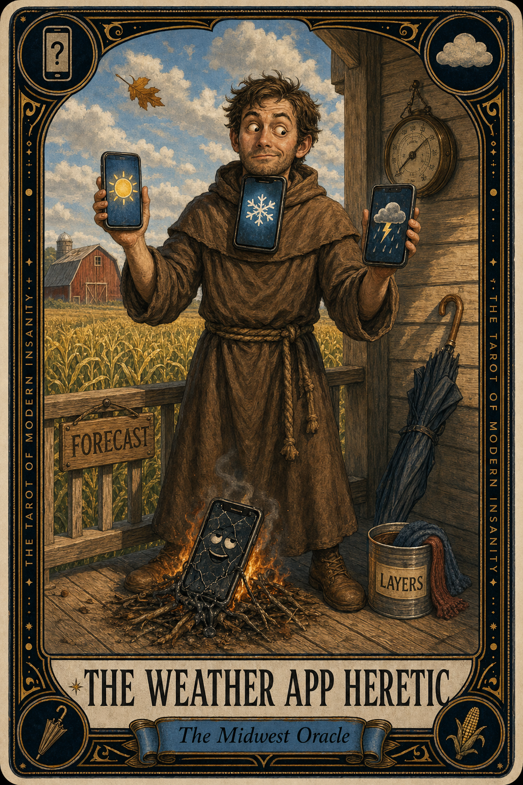

# The Weather App Heretic

## Meaning

The Weather App Heretic appears when you have consulted three forecasts in twenty minutes and arrived at less certainty than when you started. Each app gave you a different sky. Each one was confident. None of them agreed with the others.

You are not weighing data. You are scrolling through possible weeks, hoping one of them will gently take command of your jacket choice.

## When this appears

No actual sky outside the window yet.
Three forecasts open in three tabs.
A fourth opening, just to break the tie.
The radar is a green smear.
The hourly is a small staircase of question marks.

Then your brain steps in:

> "Maybe if I check one more, the universe will commit."

## The Goblin Claim

> "There is a correct forecast and you have not earned it yet."

## Reality Check

The forecasts disagree because the sky is large and the math is humble. Three confident apps do not produce one true answer. They produce a committee.

You are not a meteorologist. You are a person trying to decide whether to bring a jacket.

The weather will arrive on time and ignore your research. The only useful question is what you will wear when it gets here.

## Useful Action

Close the other tabs. Pick one app. Trust it for today.

1. Choose the forecast you have used longest, not the most flattering one.
2. Close the other two without checking them again.
3. Put a layer in your bag regardless of what any of them said.

Suggested phrase:

> "I have consulted the council. I am wearing the jacket."

## Quote

> "The sky was not waiting for you to refresh. It was already deciding what to do without your permission."

## Tiny Ritual

Walk to the nearest window. Look at the actual sky for ten full seconds without verifying it against any device. Notice if the light is gray, gold, flat, or strange. Then reset with: window, sky, breath, jacket, door, weather.

## Social Caption

The Weather App Heretic appears when you have checked three forecasts in twenty minutes and now trust none of them. Pick one app. Trust it for today. Bring a layer anyway. The sky is not waiting for your final verdict.

## Worksheet Prompt

The forecast I will trust today is: ______________________

The forecasts I will close without re-reading them are: ______________________

The layer I am bringing regardless of what the apps said is: ______________________

The actual sky outside my window right now looks like: ______________________

Official ruling:

> "You are not behind on weather. You are a person, not a satellite, and the jacket is enough."
