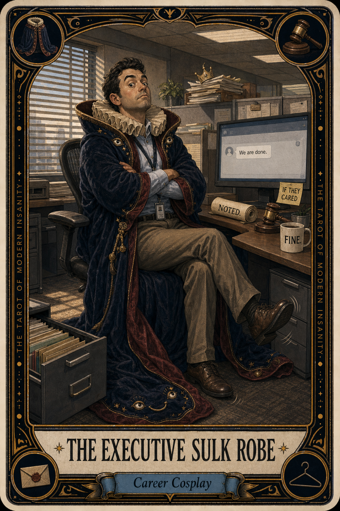

# The Executive Sulk Robe

## Meaning

The Executive Sulk Robe appears when something at work has wounded you and instead of saying so, you have begun wearing your displeasure as outerwear. It is a full ceremonial garment now. Heavy sleeves. Velvet collar. Visible from space.

You will not take it off until someone notices. You will, however, refuse to confirm that you are wearing it at all.

## When this appears

You answer a Slack message with three words and a period.

You decline to suggest a time.
No anger.
No conversation.
No raised voice.
Just a barometric drop in the entire room.

Your nervous system, draped in its finest indignant velvet, whispers:

> "If they actually cared, they would ask."

## The Goblin Claim

> "They should know what they did, and I will not be elaborating."

## Reality Check

Yes, something is probably wrong. Yes, they probably should have noticed. They did not, because most people are walking around inside their own weather and cannot see yours through it.

The robe is not communication. It is a costume of communication, which is a different garment entirely.

Nobody is going to interview the robe. The robe must speak for itself, or come off.

## Useful Action

Pick one person who is safe enough to hear it. Then, in one sentence, name the actual thing.

1. Locate the wound under the costume. Not the long version, the small true one.
2. Compress it to one line.
3. Say it out loud, to them or to yourself first.

Suggested phrase:

> "I'm not okay with how that meeting went, and I haven't said so until now."

## Quote

> "Sulking is communication's beautifully tailored decoy. Your point is wearing a costume that prevents your point from being heard."

## Tiny Ritual

Physically remove the robe. Stand up, mime lifting something heavy off your shoulders, drop it on the floor, and step out of it like a queen abdicating. Then do one small physical reset: water, fresh shirt, open window, sunlight, or splashing cold water on your face like someone surfacing.

## Social Caption

The Executive Sulk Robe appears when you wear professional disappointment as outerwear instead of addressing it. The robe will not speak for you. Take it off, then say one true sentence to one safe person. That is the work.

## Worksheet Prompt

What I want them to notice without saying:

> _______________________________

The one sentence I have not said out loud:

> _______________________________

The person who could safely hear that sentence first:

> _______________________________

Official ruling:

> "The robe is allowed to exist for one more hour, then it goes in the laundry, and you say the actual sentence."
