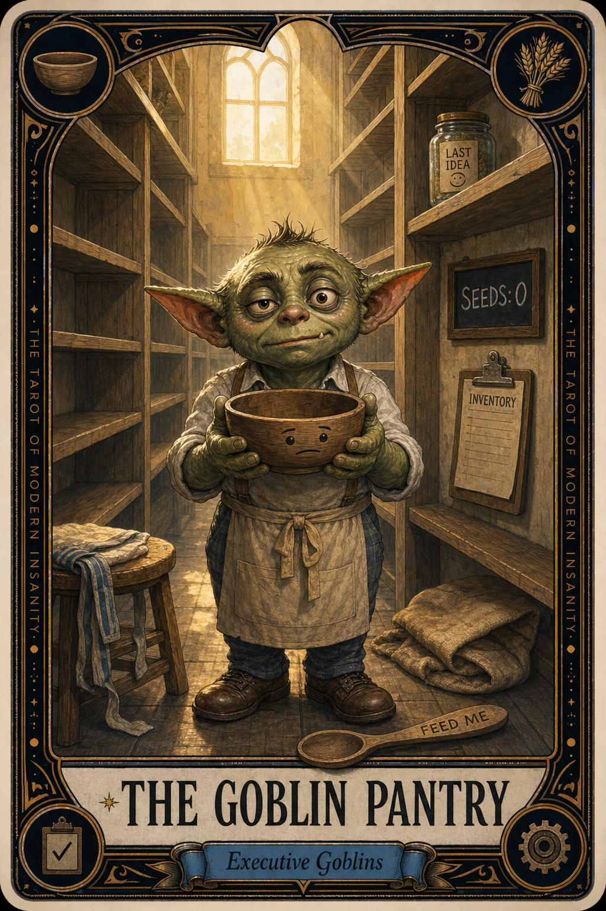

# The Goblin Pantry

## Meaning

The Goblin Pantry appears when the system you built to save you from forgetting finally turns around and asks what you brought it.

You made the wheel. You greased the wheel. You set the wheel to spin at 6 AM. And then you wandered off and stopped feeding it grain. Now there is a goblin in the pantry holding an empty bowl, looking at you with no judgment, only patience.

## When this appears

The automation runs on time. The folder is empty.  
No new ideas in the bucket.  
No notes filed.  
No half-thoughts scribbled at red lights.  
No "save this" texts to yourself at 11 PM.  
The pipeline is alive and the pipeline is hungry.

> "I was promised seeds and there are no seeds."

## The Goblin Claim

> "You built the machine. You owe the machine. Pay up."

## Reality Check

A system that captures your scattered brain only works if your scattered brain keeps scattering into it.

Automation does not generate context. It distributes context you already gathered. The wheel turns the grain into bread; somebody still has to grow the grain.

This is not failure. This is the bill coming due, on time, exactly as designed.

## Useful Action

Add three new seeds to the queue right now. Not later today. Not "after this thing." Now, before you close this card.

1. Open the seed file.
2. Write three rough ideas. Even bad ones. Especially bad ones.
3. Save the file and close it.

Suggested phrase:

> "I am the farmer. The wheel cannot eat itself."

## Quote

> "The machine you built to remember for you still needs you to remember it exists."

## Tiny Ritual

Walk to the kitchen. Open a cabinet, any cabinet. Look at the food in it. Then go back and put one idea in the seed file like you are restocking a real shelf. One thing on the shelf is enough: water, shower, socks, sunlight.

## Social Caption

The Goblin Pantry appears when the system you built to save you from forgetting runs out of things to remember. Automation does not generate context. It distributes the context you gathered. Feed the wheel before it eats itself.

## Worksheet Prompt

What the pantry is actually missing this week:

> _______________________________

Three rough seed ideas I can drop in right now, even bad ones, even half-formed:

> _______________________________

The smallest possible version of feeding the system that I can do today:

> _______________________________

What feeling makes me wait to fill the file instead of just filling it:

> _______________________________

Official ruling:

> The wheel is not broken. The wheel is hungry. Feed it three things, today, and let it spin.
