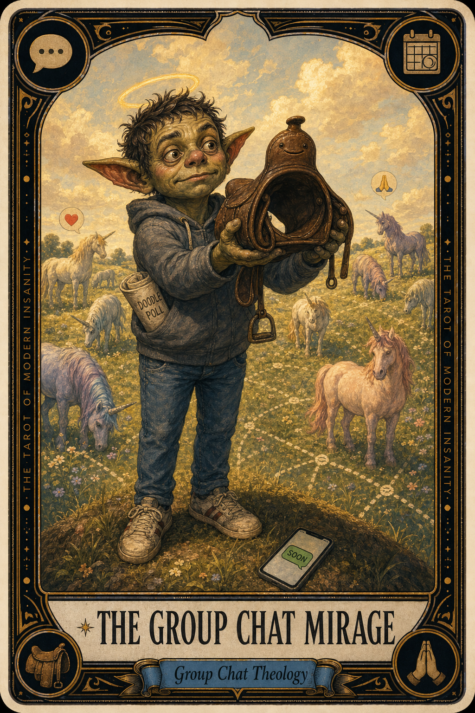

# The Group Chat Mirage

## Meaning

The Group Chat Mirage appears when six adults agree that yes, absolutely, we should get dinner, and then the chat goes silent for eleven days.

It is not a failure of love. It is the natural endpoint of every group thread with more than three people. The intention is real. The Doodle poll is real. The dinner is a unicorn, and unicorns require one person to print a saddle.

## When this appears

Someone says, "we should totally do this."
Three people heart-react.
Two people send the praying-hands.
One person sends a calendar emoji, sweating slightly.
Nobody picks a date.
The thread enters a respectful, well-loved coma.
Eleven days pass. Somebody types "lol" and goes quiet again.

> "Soon. For sure. 100 percent. Soon."

## The Goblin Claim

> "If we mean it enough, the dinner happens by itself."

## Reality Check

A group chat is not a plan. A group chat is a feeling shared briefly by adults who all have other tabs open.

The plan is a different organism. The plan needs one person to be a tiny mid-level project manager for ninety seconds. That person almost never volunteers, because volunteering feels weirdly bossy, but the truth is everyone is silently begging for that person.

Be that person. Once.

## Useful Action

Pick a real date. Send it as a statement, not a question. The group needs a verb.

1. Open the chat.
2. Type: "Thursday the 30th, 7 PM, my place. Bring something or do not. RSVP for headcount."
3. Hit send before you can soften it.

Suggested phrase:

> "I am the saint with the saddle today."

## Quote

> "A group chat is a feeling. A plan is a date. The dinner needs a verb, not seven hearts."

## Tiny Ritual

Open the most dormant group chat you love. Send one specific date and time. Do not apologize for being the one who said it. Then close the app and let the chat metabolize. Water, snack, socks, sunlight, or putting on a podcast.

## Social Caption

The Group Chat Mirage appears when six adults agree we should totally do this, then the thread goes silent for eleven days. The chat is the feeling. The plan is the date. Be the saint with the saddle. The dinner needs a verb.

## Worksheet Prompt

The group chat I have been "soon-ing" the longest:

> _______________________________

The actual date and time I could pick that would make this real:

> _______________________________

The version of me that does not want to look bossy by picking a date is afraid of:

> _______________________________

What I would like the dinner to feel like once it actually happens:
