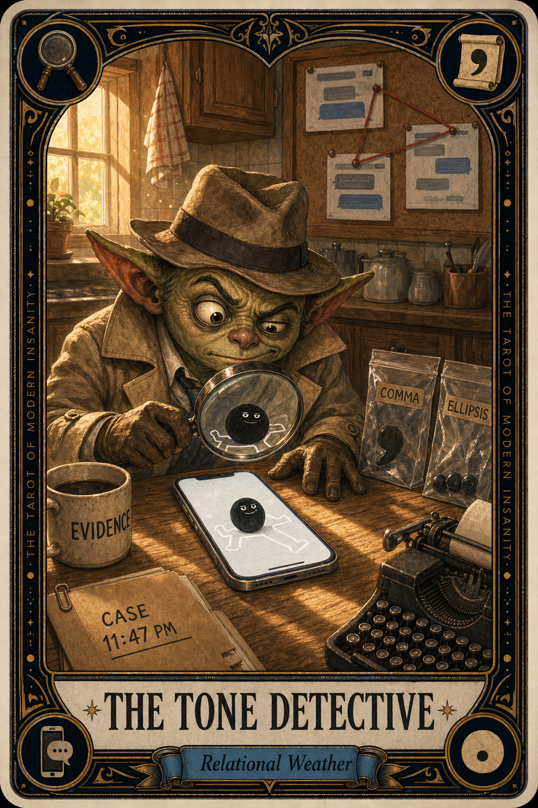

# The Tone Detective

## Meaning

The Tone Detective appears when one period at the end of a text triggers a full forensic investigation in your kitchen. A friend wrote "Sounds good." and you have now dusted the message for prints, sequenced the comma history, and called in a comma specialist.

The text is one sentence long. Your inner detective has filled three evidence bags.

## When this appears

Someone you love ends a text with a period.
Someone uses one fewer exclamation point than usual.
A boss replies "Got it." with no emoji.
The thumbs-up has arrived alone, with no warmth in its eyes.
Your phone is now a crime scene.

> "Read it again. There has to be a clue."

## The Goblin Claim

> "The punctuation knows something I do not."

## Reality Check

Texts have no tone of voice, no eyebrows, no hand gesture, no warm laugh in the background. Into that vacuum, your brain pours its worst possible interpretation, because the worst-case brain is always on call and refuses overtime pay.

Most people who end a text with a period are not angry. They are tired, on the bus, or trying to be punctual. The text is rarely the murder weapon.

## Useful Action

Read the message exactly once. Then, if it still feels off, ask the actual person what they meant. Skip the screenshot and the forensic team.

1. Reread the text once, not nine times.
2. Send one direct, friendly question.
3. Put the phone face down until they answer.

Suggested phrase:

> "Hey, quick read check: was that period a normal period or a feelings period?"

## Quote

> "A period is not a confession. Most of the time it is just somebody who is finished typing."

## Tiny Ritual

Put the phone face down on the counter. Say out loud, "Case closed pending further evidence." Walk to a different room and do one small physical reset: water, shower, socks, sunlight, or a slow lap around the block with no headphones.

## Social Caption

The Tone Detective appears when one period in a text opens a full forensic investigation. A period is not a confession. Read it once, ask the actual person what they meant, and let your brain leave the crime scene.

## Worksheet Prompt

The text I have personally upgraded to a federal investigation:

> _______________________________

What the worst-case brain thinks the period means:

> _______________________________

What the period probably actually means, on a calm reread:

> _______________________________

The simplest, kindest question I could ask the actual person:

> _______________________________

Official ruling:

> Punctuation is not a personality. The period is innocent until proven