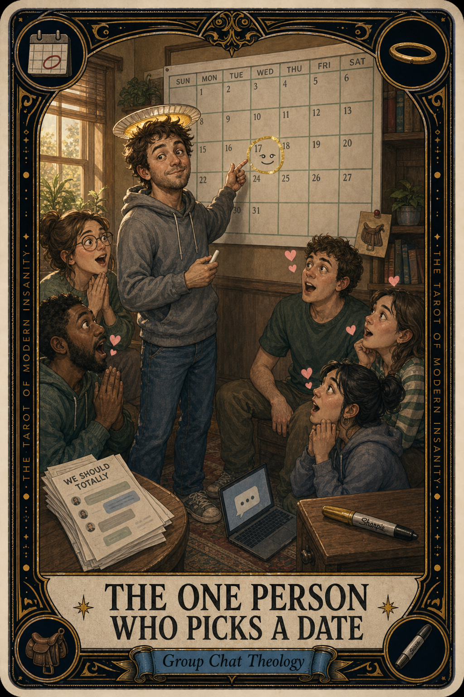

# The One Person Who Picks a Date

## Meaning

The One Person Who Picks a Date appears when a friend group has been "soon-ing" for a month and the air finally needs a verb.

There is exactly one saint per group thread, and it is whoever finally types Thursday the 14th, 7 PM, my place. They were not chosen. They got tired of the fog and started a kitchen instead.

## When this appears

A "we should totally" has been hovering for ten days.
Nobody has booked the babysitter.
Nobody has named the restaurant.
Three calendar emojis. Two praying-hands. One sweating clock.
You feel the small civic itch.
You already know you are going to be the one.

> "Fine. Saint duty. Here I go."

## The Goblin Claim

> "If I pick the date, I am the bossy one."

## Reality Check

Picking a date is not bossy. It is mercy.

Everyone in the thread is silently waiting to be told what to do, because deciding feels like exposure and following feels like relief. The saint is not in charge of the friendship. The saint is the person who decided fog is exhausting and pulled out one sturdy chair.

Be that chair.

## Useful Action

Pick one specific date and time. Send it as a statement. Then close the app and let the group land.

1. Open the chat that has been hovering.
2. Type one line: a real date, a real time, a real place.
3. Send. Do not soften it. Do not add "if that works for everyone."

Suggested phrase:

> "Saddle's printed. Thursday. Be there."

## Quote

> "Group chats run on hope. Plans run on one person who got tired of hoping."

## Tiny Ritual

Open the dormant thread. Send one date. One time. One place. Do not RSVP-soften it with "no pressure." Then put the phone face down and walk away from the chat like you just lit a candle in a quiet church. Water, snack, socks, sunlight.

## Social Caption

The One Person Who Picks a Date appears when six adults have been "soon-ing" forever. Picking a date is not bossy. It is mercy. Send Thursday, 7 PM, your place. Be the saint with the saddle.

## Worksheet Prompt

The group chat that has been waiting for me to break the silence:

> _______________________________

The exact date and time I could send today, no later than tonight:

> _______________________________

The thing I am afraid will happen if I am the one who picks the date:

> _______________________________

The version of me who