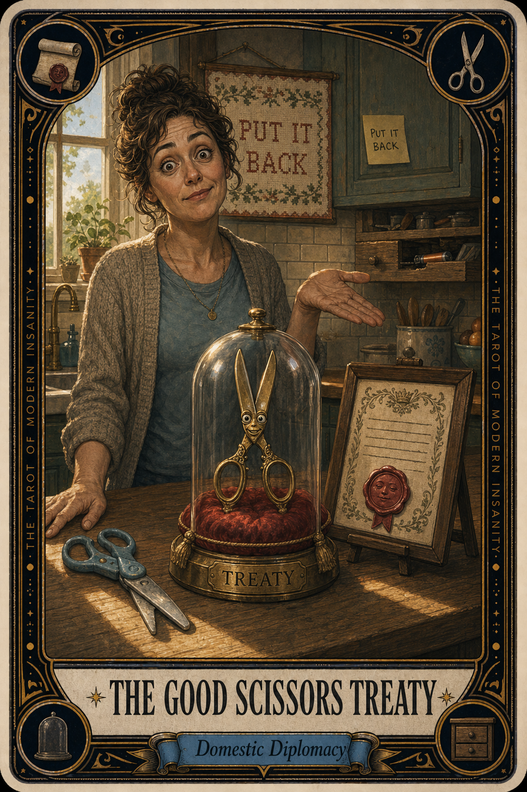

# The Good Scissors Treaty

## Meaning

The Good Scissors Treaty appears when the household has one pair of scissors that actually cut, three pairs that pretend, and a sacred agreement nobody enforces.

The treaty was signed at some point. The terms were clear. The scissors go back to the drawer, sharp side down, after every use. The treaty is mostly lyrical. The drawer is mostly empty.

## When this appears

You go to the kitchen drawer.
The drawer contains a butter knife and a single dead battery.
You check the junk basket.
You check the bathroom for some reason.
You check the kid's room and immediately regret it.

> "I'll just rip this with my teeth."

## The Goblin Claim

> "Whoever moved the scissors did it personally to me."

## Reality Check

A household is a small republic of borrowed objects. Everyone agrees in principle. Everyone defects in practice. The scissors do not vanish out of malice. They vanish because somebody needed to open a package at 11 PM and the kitchen was technically on the way to the couch.

The treaty is fine. The enforcement is the problem, and the enforcement is a vibe.

## Useful Action

Put the good scissors back in the drawer today. Say nothing. Sign no proclamations. Diplomacy is what you do, not what you announce.

1. Find the scissors wherever they ended up.
2. Walk them to the drawer.
3. Close the drawer with full ceremony or no ceremony, either is fine.

Suggested phrase:

> "I am restoring the scissors to their treaty drawer."

## Quote

> "Every household runs on a treaty nobody reads. The scissors are the page everyone keeps tearing out."

## Tiny Ritual

Open the drawer. Place the good scissors back, sharp side down, with the gravity of a country signing a small treaty in a wood-paneled room. Then go do one quiet physical thing for yourself: water, snack, socks, sunlight, or a slow walk to the mailbox.

## Social Caption

The Good Scissors Treaty appears when the household has one pair that actually cuts and a sacred agreement nobody enforces. The treaty is fine. The enforcement is a vibe. Walk the scissors back to the drawer today. Say nothing. That is the whole job.

## Worksheet Prompt

The treaty item I have most recently broken in my household:

> _______________________________

Where the good scissors actually are right now:

> _______________________________

The household member I most enjoy quietly suspecting of moving the scissors:

> _______________________________

The smallest thing I could quietly put back where it belongs today:

> _______________________________

Official ruling:

> The trea