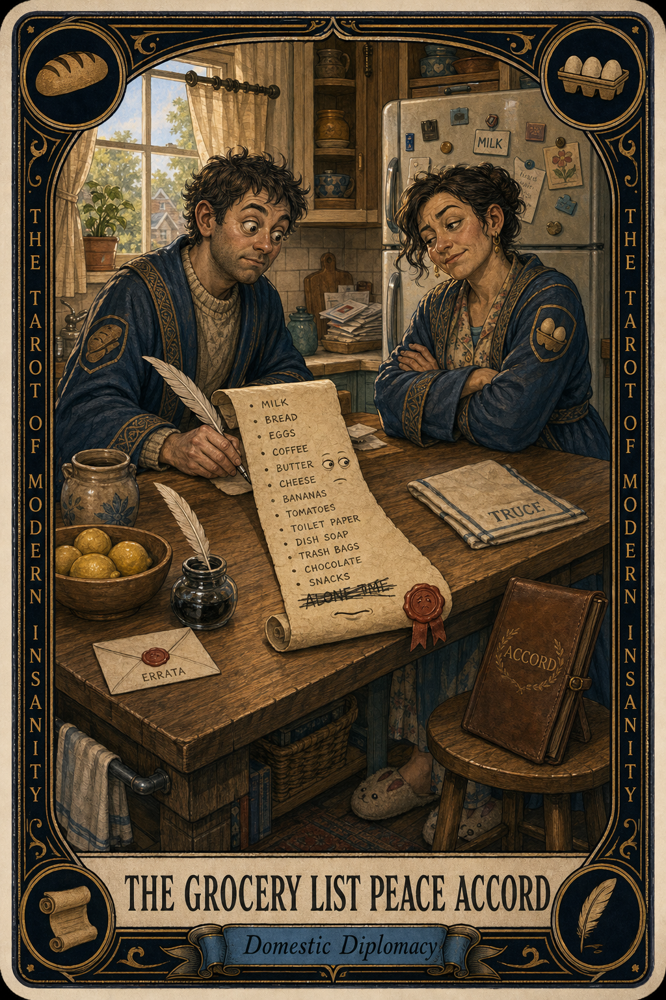

# The Grocery List Peace Accord

## Meaning

The Grocery List Peace Accord appears when one household has been quietly running on the goodwill of four remembered items and one item that nobody wrote down on purpose.

It is not malice. It is the slow drift of shared logistics into a low-grade emotional ledger, where milk is milk and also a small footnote about who is paying attention this week.

## When this appears

The list says four things. Someone comes home with three.
No apology.
No explanation.
Just a bag, a fridge, and a faint diplomatic chill.
The fifth item, the one no one wrote down, is also missing.

> "It was on there. It was definitely on there. I am sure it was on there."

## The Goblin Claim

> "The list is in my head, and my head is the official list."

## Reality Check

Shared logistics are not just logistics. They are how two people prove to each other that they were listening this week.

The forgotten thing is rarely the actual problem. The actual problem is that the list lives in one person's head while the other person assumes it lives in the air.

Put it on paper. Or a phone. Anywhere outside skulls.

## Useful Action

Build one shared list today, before the next quiet betrayal happens.

1. Open the notes app or grab a magnet pad.
2. Write the four things you already know you need.
3. Send the link to the other person, or stick the pad on the fridge.

Suggested phrase:

> "I am declaring this list a neutral country."

## Quote

> "A shared grocery list is a peace treaty written in eggs, bread, and the one thing nobody remembered."

## Tiny Ritual

Stand at the fridge with the bag still in your hand. Open the shared list and add the missing item out loud, like a diplomat reading the terms. Then close the app. Water, snack, socks, sunlight, or a brief unrelated podcast.

## Social Caption

The Grocery List Peace Accord appears when one household runs on four remembered items and one quiet omission. The forgotten thing is not the problem. The list living in one person's head is the problem. Build one shared list today.

## Worksheet Prompt

The item that is always missing in our house:

> _______________________________

The person who is silently keeping the running list in their head:

> _______________________________

One place we could put a shared list that both of us would actually look at:

> _______________________________

What I want the kitchen to feel like when nobody is keeping score:

> _______________________________

Official ruling:

> Civi