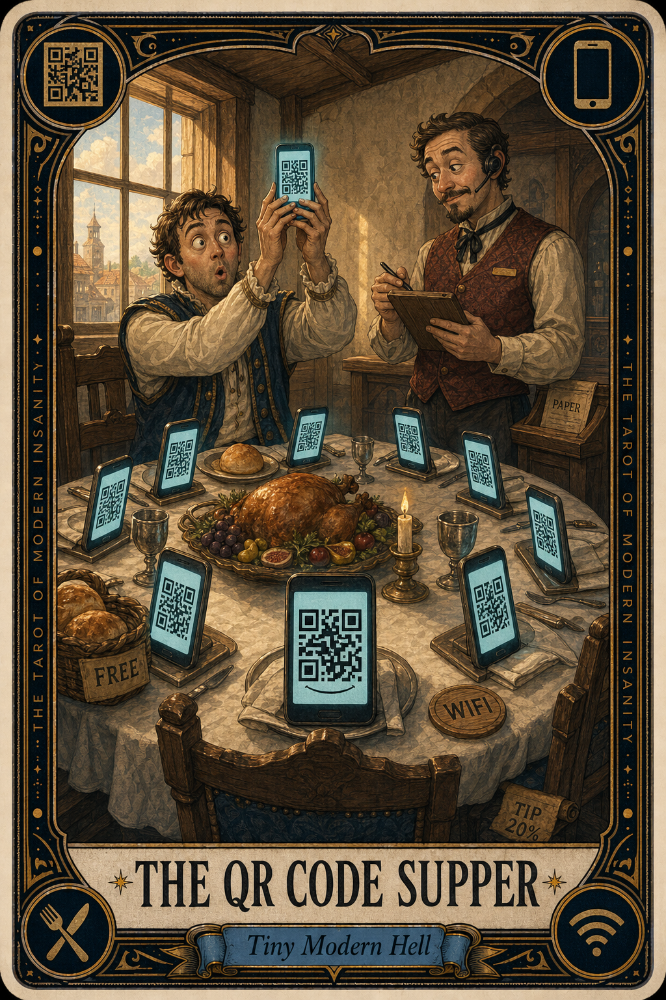

# The QR Code Supper

## Meaning

The QR Code Supper appears when dinner begins with administrative onboarding. The host smiles, the candle is lit, and the first task of the evening is to log into a menu using the same wifi password.

It is hospitality outsourced to your battery. Your reading glasses are in the car. Your phone is at six percent. Somewhere a sommelier has been replaced by a loading spinner.

## When this appears

You sit down to be fed.

A small square asks for your camera.
The wifi has a password.
The password is on a coaster.
The coaster is on another table.
Nobody can decide who is ordering the bread.

> "We are here to eat. We are also somehow logging in."

## The Goblin Claim

> "If you cannot scan, you do not deserve dinner."

## Reality Check

A restaurant is still a restaurant. The menu is still a menu. You are allowed to be a person who eats with a fork rather than a person who pairs devices.

Hospitality migrated to your pocket without asking, and the workers behind the counter know it is weird too. Most of them keep one paper menu under the host stand for exactly this moment.

Ask. Kindly. Eat the bread.

## Useful Action

Ask the server for a paper menu without apologizing for being a human.

1. Catch their eye.
2. Say the sentence below.
3. Put the phone face-down on the table.

Suggested phrase:

> "Could I see a paper menu, please. My phone and I are taking the night off."

## Quote

> "A meal is not a software update. You do not have to accept the new terms before the bread arrives."

## Tiny Ritual

Place your phone face-down on the table like a small retired pet. Order one thing without scrolling. Drink water before the appetizer arrives. Then: water, bread, napkin in lap, eye contact with whoever you came with.

## Social Caption

The QR Code Supper appears when dinner begins with logging in. A meal is not a software update. Ask for the paper menu, kindly, without apologizing. The bread does not require two-factor authentication.

## Worksheet Prompt

The last meal that started with a camera and a wifi password:

> _______________________________

What I actually wanted from that dinner, beneath the scanning:

> _______________________________

One sentence I could say next time, before the phone comes out:

> _______________________________

Official ruling:

> A restaurant is a