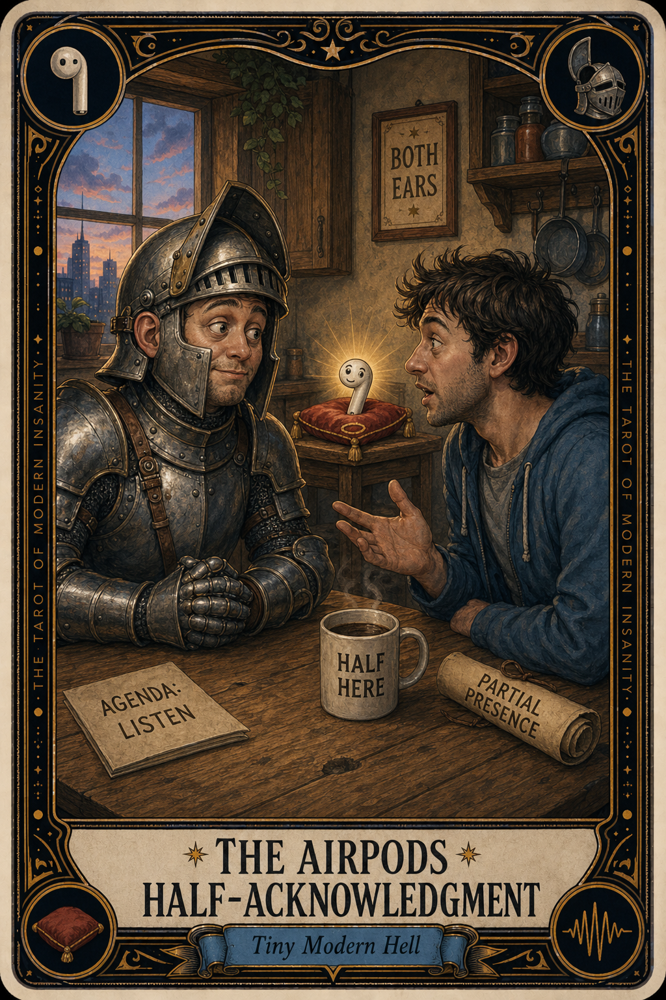

# The AirPods Half-Acknowledgment

## Meaning

The AirPods Half-Acknowledgment appears when someone you love walks into the room and you turn slightly toward them with one earbud in, like a knight who has lifted only one ear-flap of the helmet.

You are here. You are also a little bit not here. It is the universal signal of modern adulthood: present at a discount, listening at 50 percent off, available in fractions.

## When this appears

Someone walks in to ask a small thing.
You leave one pod in, just in case.
The podcast keeps going at 14 percent volume.
Half your face is in the kitchen.
Half is at a tech conference in Austin.
Nobody is fully anywhere.

> "I can listen and listen, at the same time."

## The Goblin Claim

> "If I take it out, I will miss something important."

## Reality Check

A half-acknowledgment is not a conversation. It is a polite hostage situation in which everyone agrees the person who walked in deserves about 40 percent of an ear.

The other person can hear the podcast leaking. They know. They are negotiating with the part of you that is partially elsewhere, and they are losing because the algorithm never gets tired.

Take it out for ninety seconds. Be fully one place.

## Useful Action

For the next conversation, take both pods out and put them in your pocket. Not paused. Not just "one out." Both out, both gone.

1. Pull both AirPods.
2. Drop them in your pocket where they cannot blink at you.
3. Turn your whole face toward the human in front of you.

Suggested phrase:

> "Hang on, let me put my ears back in. You get all of them."

## Quote

> "Half an ear is half a person. The dog notices. Your partner notices. The podcast does not."

## Tiny Ritual

When the next person walks in, pop both pods out at the same time and place them face-up on the counter like two small retired earrings. Look up. Say the person's name once, out loud. Then: water, eye contact, deep breath, socks.

## Social Caption

The AirPods Half-Acknowledgment appears when you greet someone with one pod in, just in case. Half an ear is half a person. Take both out for ninety seconds. Be fully one place. The podcast will not miss you.

## Worksheet Prompt

The person who most often gets the half-ear from me:

> _______________________________

What I am usually listening to when this happens:

> _______________________________

What I am secretly afraid I will miss if I take both pods out:

> _______________________________

How my last actual full-attention conversation felt afterward:

> _______________________________

Official ruling:

> The people in your room outrank the