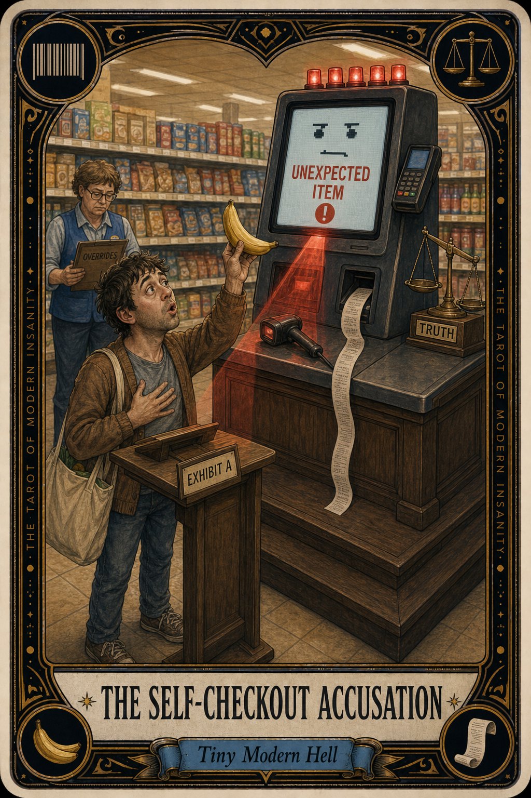

# The Self-Checkout Accusation

## Meaning

The Self-Checkout Accusation appears when a machine, with no facial expression and no inner life, publicly suggests you might be a thief over a single rogue avocado.

You did nothing wrong. The scale disagrees. The blinking red light disagrees. And a small associate in a blue vest is now walking over to render judgment, like an angel of customer service descending from a cloud of unscanned bananas.

## When this appears

You scan the cilantro.
The screen says "Unexpected item in the bagging area."
You have placed nothing in the bagging area.
The light blinks red, then redder.
A line forms behind you, a small jury of strangers with bread.
A child is watching with deep curiosity.

> "Please wait for assistance."

## The Goblin Claim

> "The kiosk has seen something. The kiosk knows."

## Reality Check

The kiosk has not seen anything. The kiosk is a small grumpy scale with the moral imagination of a hall pass. It registered that 0.3 ounces did not match its expectation, and concluded you must be smuggling a watermelon under your coat.

You are not on trial. The associate has absolved 400 people today already. Your honor is intact. The banana is fine.

## Useful Action

When accused, raise your hand. Do not apologize for existing in front of a machine.

1. Step back six inches from the kiosk.
2. Raise your hand, not too high, like a polite ghost.
3. Make eye contact with the nearest blue vest.

Suggested phrase:

> "The kiosk and I are in a disagreement. We need a mediator."

## Quote

> "A self-checkout cannot question your honor. It can only question its own scale. The associate has the override."

## Tiny Ritual

After the absolution, pause for one full breath before leaving the kiosk. Look at your receipt with the gravitas of a citizen who has been wrongly accused and gracefully pardoned. Then: water, fresh air, hands washed, three slow steps toward the parking lot.

## Social Caption

The Self-Checkout Accusation appears when a machine publicly questions your honor over a single rogue avocado. You are not on trial. The kiosk is a grumpy scale, not a tribunal. Raise your hand. The associate has absolved 400 people today.

## Worksheet Prompt

The last item I scanned that got me publicly accused:

> _______________________________

What I felt the strangers behind me were silently concluding about my character:

> _______________________________

What the blue vest actually said when they walked over:

> _______________________________

Official ruling:

> The kiosk is a scale with anxiety. You are a person with groceries. The bagging area is not a court of law.
