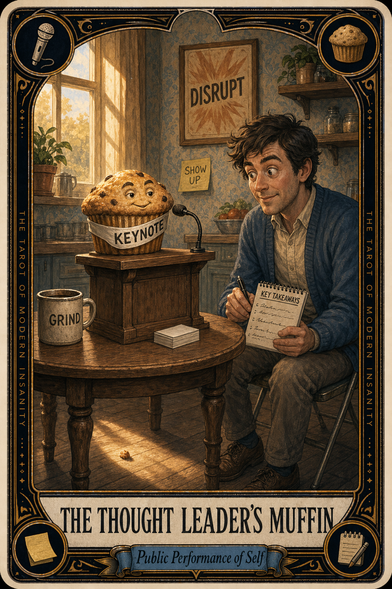

# The Thought Leader's Muffin

## Meaning

The Thought Leader's Muffin appears when a person sits down with a perfectly ordinary baked good and immediately starts narrating it for an invisible audience.

The muffin has not asked for this. The muffin would prefer to be eaten. Instead, the muffin is now a parable about resilience, scrappy beginnings, and the importance of crumbs.

## When this appears

Someone holds up a salad.
The caption begins "Lessons from my lunch:"
A barista hands over a latte and a small banner of personal philosophy unfurls.
The croissant is a case study.
The oatmeal is a leadership framework.

> "Hold on. I think this Pop-Tart has something to say."

## The Goblin Claim

> "If the muffin doesn't mean anything, neither do I."

## Reality Check

A snack is not a TED talk. A snack is fuel and frosting.

The instinct to mine every ordinary moment for insight is a real one, taught by a feed that rewards small philosophies. The platform wants the metaphor. Your body just wants the carbs.

Let the muffin be a muffin today. Nobody is grading the parable.

## Useful Action

Eat one thing today without composing a metaphor about it. No takeaways, no insights, no slide ready for Monday.

1. Pick the next snack already in your hand.
2. Notice the texture, notice the salt, notice nothing else.
3. Do not draft a caption. Do not even think the word "lessons."

Suggested phrase:

> "This muffin is off the record."

## Quote

> "Not every snack is a metaphor. Sometimes a muffin is breakfast trying to keep you alive until 11 AM."

## Tiny Ritual

Pick up your snack, make brief dignified eye contact with it, and say out loud:

> "You are not content."

Then eat it slowly, with no audience and no caption being drafted. Water, sunlight, sock adjustment, a short walk to the kitchen window.

## Social Caption

The Thought Leader's Muffin appears when a snack gets recruited to perform meaning. Not every croissant is a case study. Not every latte is a leadership lesson. Some food is just food trying to get you to 11 AM. Eat the muffin.

## Worksheet Prompt

The ordinary thing I most recently tried to turn into a metaphor:

> _______________________________

What the thing was actually doing for me, in plain language:

> _______________________________

The audience I was secretly performing for when I drafted that take:

> _______________________________

What I would do with this snack if nobody was watc