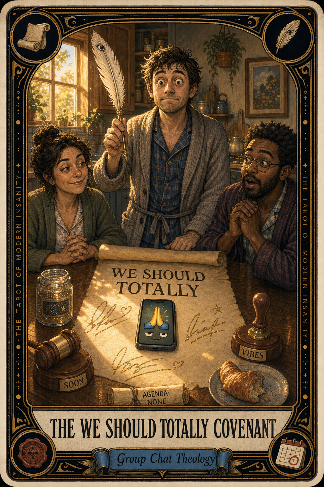

# The We Should Totally Covenant

## Meaning

The We Should Totally Covenant appears the moment two or more adults declare, with full sincerity, that we should totally do this soon. Everyone nods. Nobody opens a calendar.

It is a ceremonial promise with no lawful force. Signed in praying-hands emojis, witnessed by the void, enforceable in no court. The covenant is sacred. The covenant is also fictional.

## When this appears

Someone says, "we should totally grab dinner this summer."
You say, "yes, please, I would love that, let's do it."
Both of you feel like a plan has occurred.
No date is named.
No app is opened.
Three weeks pass.
Both of you walk away warmed by the entirely imaginary future.

> "We just made a thing happen, basically."

## The Goblin Claim

> "We said it warmly enough, so it is basically already happening."

## Reality Check

A covenant is a promise with a witness. The witness in this case is your shared optimism, which is structurally incapable of holding anyone accountable.

We should totally is not a verb. It is a vibe. It is the feeling of agreeing to a future you have not yet built. The future does not build itself. Somebody has to draft the calendar invite.

That somebody can be you, briefly.

## Useful Action

Within twenty-four hours of saying "we should totally," send the next message yourself. Convert the feeling into a verb.

1. Open the chat or text thread.
2. Propose one specific date and one specific time.
3. Hit send before you can soften it into a question.

Suggested phrase:

> "Coffee, Thursday the 5th at 10 AM, the usual spot. Yes or no, no maybes."

## Quote

> "We should totally is sacred only on the day the calendar invite goes out. Until then, it is a feeling wearing a robe."

## Tiny Ritual

Open the most recent we should totally promise you have made. Out loud, say: "I solemnly upgrade this vibe to a verb." Then propose a date in the thread. Close the app. Reset with water, a walk around the block, snack, socks, sunlight.

## Social Caption

The We Should Totally Covenant appears when two adults promise a future they have not yet built. The covenant is sacred. The covenant is also fictional. Convert the vibe into a verb: propose one specific date within twenty-four hours.

## Worksheet Prompt

The most recent we should totally I made:

> _______________________________

The person I made it with:

> _______________________________

The specific date and time I could propose to make it real:

> _______________________________

The version of me that prefers a sacred vibe to a written-down plan is afraid of:

> _______________________________

Officia