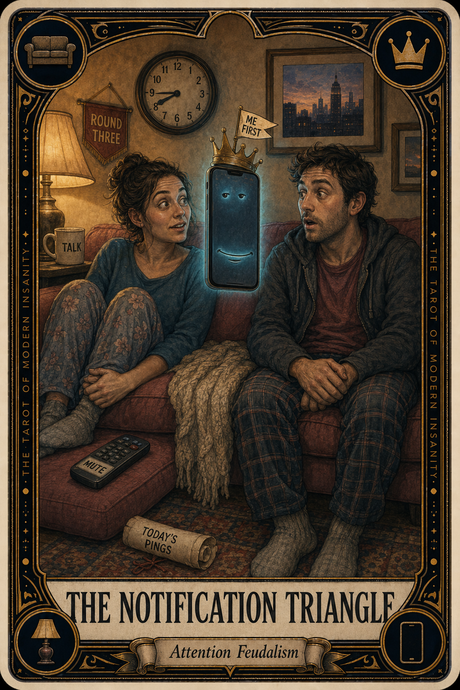

# The Notification Triangle

## Meaning

The Notification Triangle appears when two people who chose each other find themselves seated on the same couch, in the same lamplight, with a small glowing third party between them, holding all the floor.

The triangle is geometrically stable because the phone never gets tired, never gets bored, never asks for a snack. It has the energy of a houseguest who pays no rent and refuses to leave.

## When this appears

You start a sentence.
The phone hums in someone's lap.
The sentence pauses politely.
A small smug glow flickers between you.
Someone says "sorry, what was that."
Nobody can remember what.
The couch grows half a foot wider.

> "Wait, hold on, this is just one quick thing."

## The Goblin Claim

> "The third party is more interesting than the second one."

## Reality Check

The phone has no skin in this couch. It does not know either of your names. It is, however, professionally designed by a team of strangers to win every small contest for your eyeballs.

That is not a moral failing on your part. That is the contest being uneven. You can rig it back. The room will hold.

## Useful Action

Pick ten minutes tonight where the third party leaves the room. Not the relationship. The room.

1. Set a timer for ten minutes.
2. Put both phones face-down in the kitchen or in a drawer.
3. Sit on the couch. Talk about nothing. Notice the room.

Suggested phrase:

> "Let's put the glowing one in the hallway for a bit."

## Quote

> "A phone never gets tired of you, which is exactly why it cannot love you back."

## Tiny Ritual

Find the spot on the couch where the phone usually lives. Pat it twice. Move the phone three rooms away, gently, like relocating a small bureaucrat. Then come back and rejoin the couch. Water, socks, lamp on, blanket, eye contact.

## Social Caption

The Notification Triangle is the most stable shape in modern relationships, because the third party never gets tired. Move the glowing one to another room for ten minutes tonight. The couch is allowed to be a two-person couch again.

## Worksheet Prompt

The conversation we keep half-finishing because the third party kept ringing:

> _______________________________

The room or time of day where the triangle is worst:

> _______________________________

What a ten-minute couch with no glowing third party would actually feel like:

> _______________________________

The first thing I would actually want to say if the phone left the couch:

> _______________________________

Official ruling:

> A two-person c